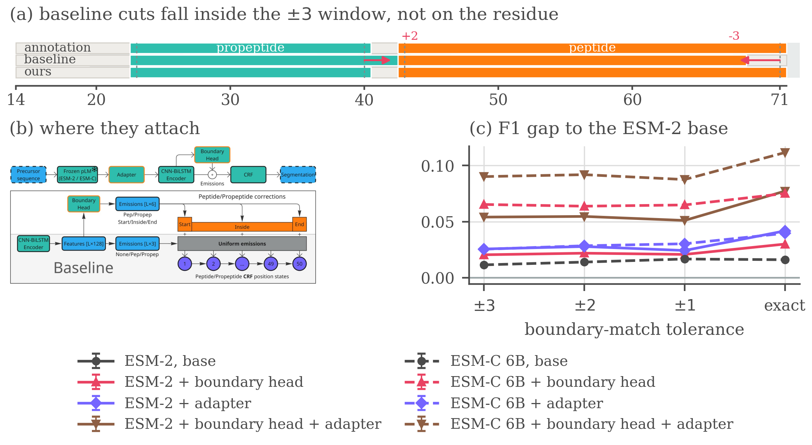
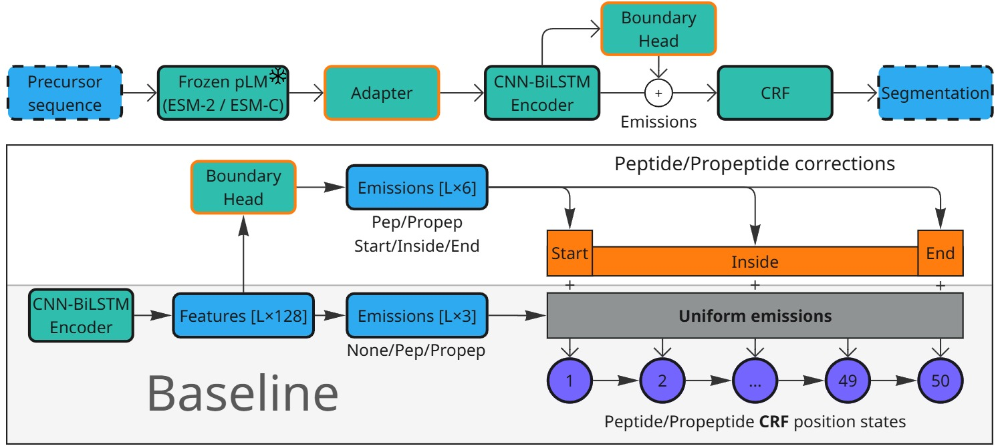
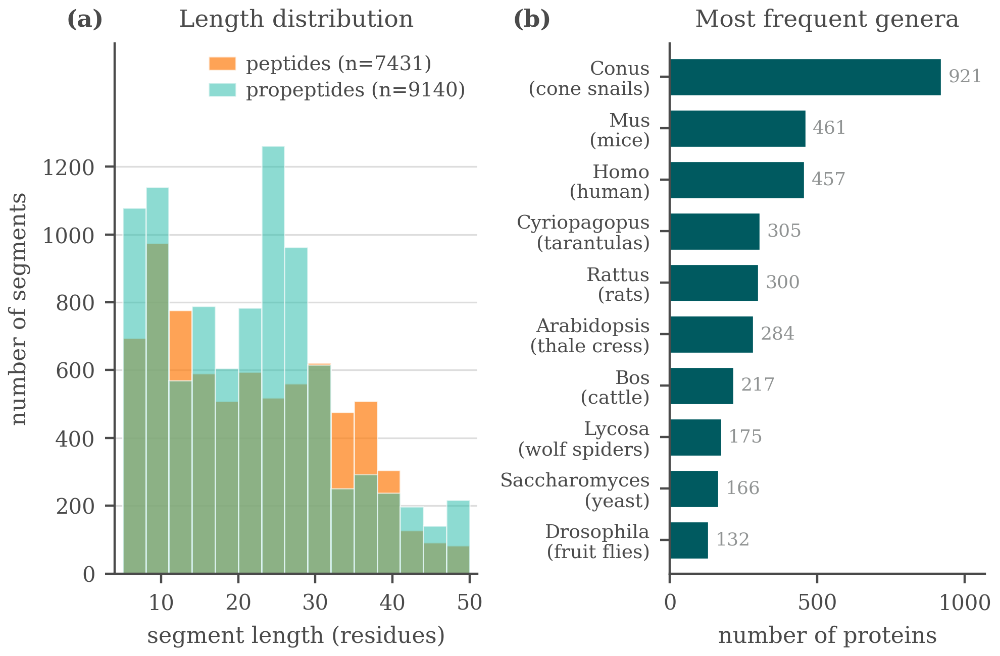
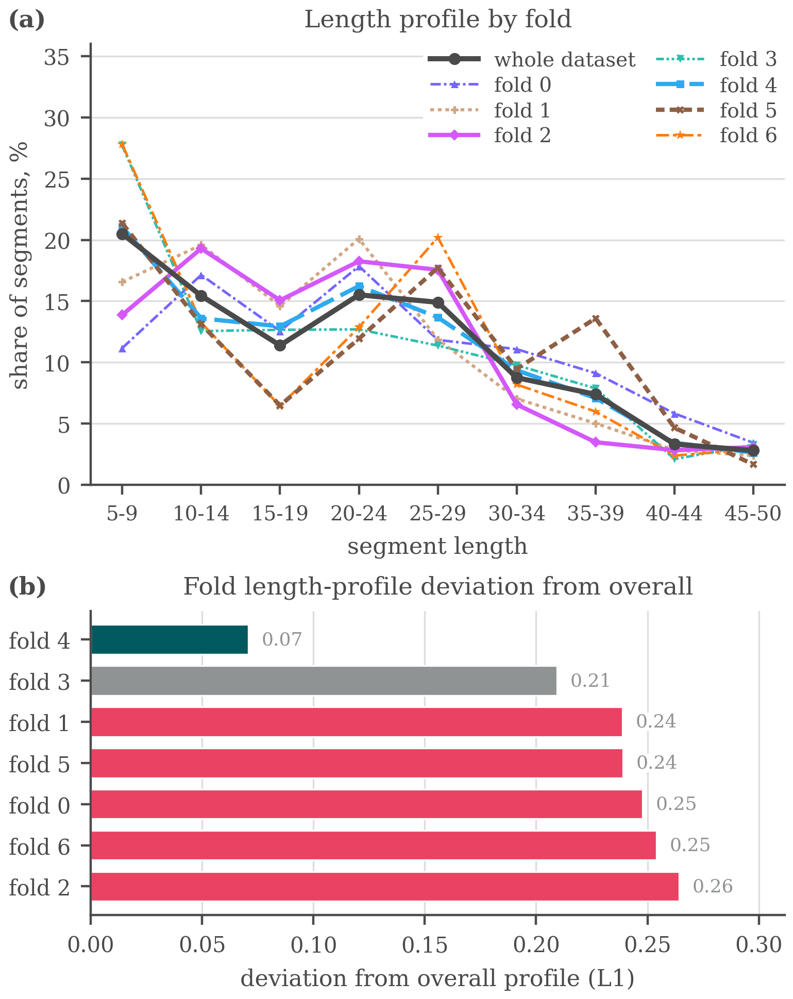
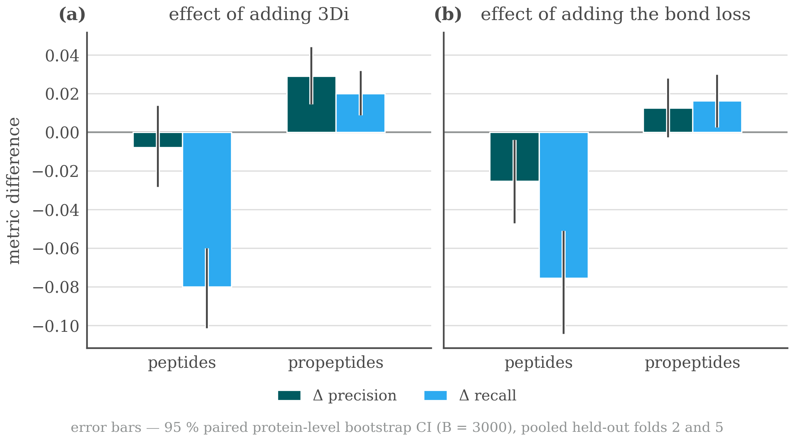
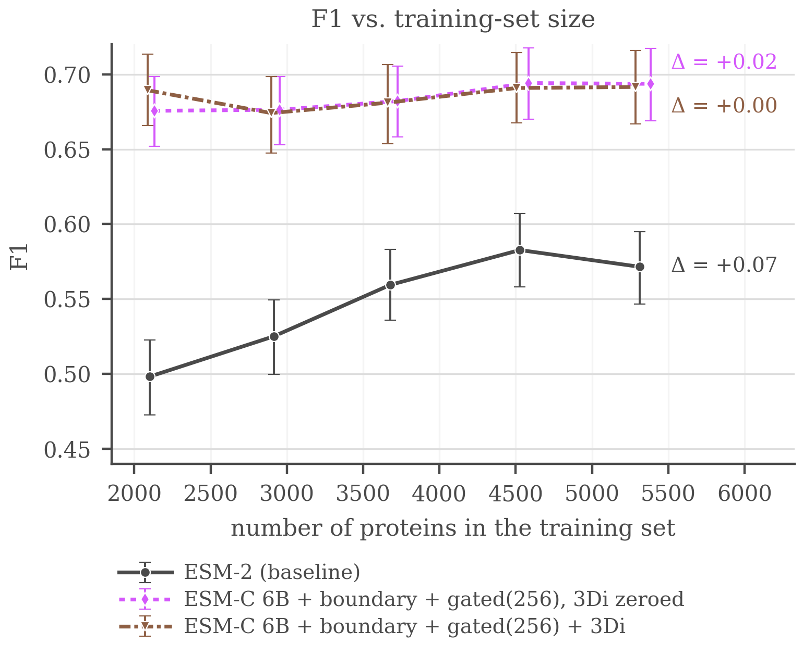
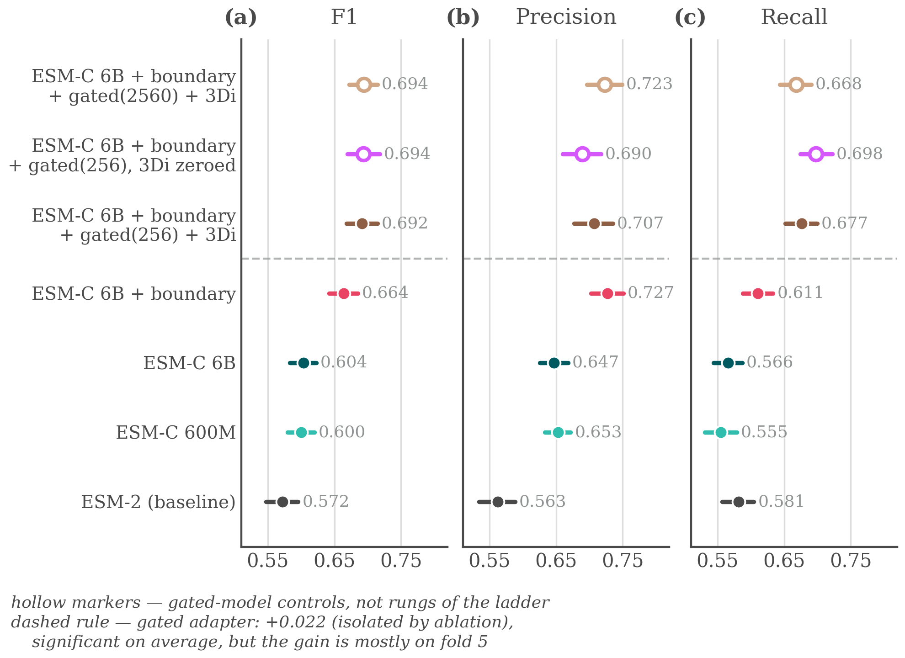
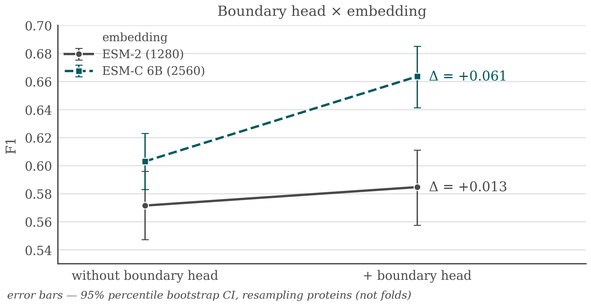
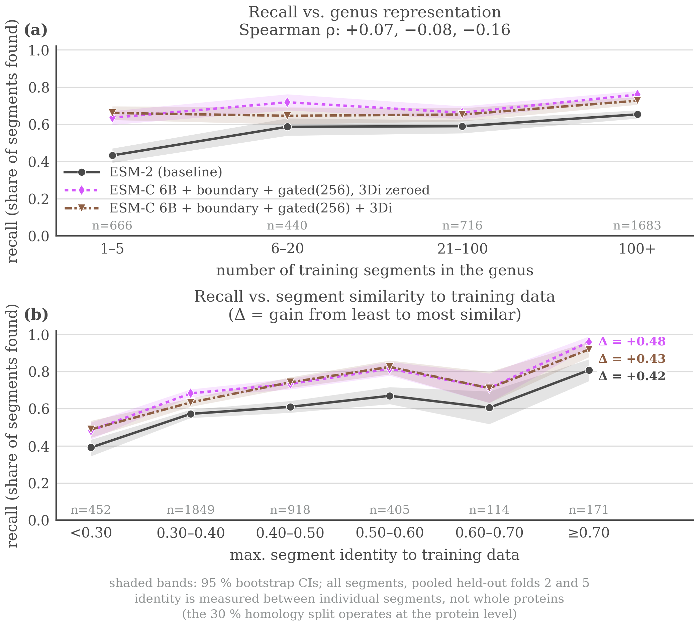

# Sharper Boundaries: Position-Aware CRF Emissions and an Embedding Adapter for Predicting Proteolytic Peptides and Propeptides

*Anonymous submission — AI4DD @ NeurIPS 2026. Rendered from `texs/ai4dd/main.tex`.*

## Abstract

Proteolysis cuts precursor proteins into mature peptides and propeptides, and predicting where is a sequence segmentation task with direct applications in proteomics, vaccine design, and disease research. The strongest existing approach couples frozen protein language model (pLM) embeddings with a CNN–BiLSTM encoder and an extended-state linear-chain conditional random field (CRF) decoder, but its CRF emissions are identical for every state of a given segment type at a given position, even though the decoder's own state structure already distinguishes a segment's start, interior, and end. We close this gap with two small, independent additions: a zero-initialized boundary head that adds position-specific corrections to the relevant CRF emissions, and a lightweight adapter that re-projects the pLM embedding before the encoder. Evaluated with the same 5×4 nested cross-validation DeepPeptide itself uses, on a rebuilt UniProtKB/Swiss-Prot 2026 dataset, both additions outperform the base architecture on ESM-2 embeddings individually (+0.021 and +0.026 F1) and combine to a +0.054 F1 gain over the 0.576±0.029 base, close to the sum of the two. On higher-capacity ESM-C 6B embeddings the same protocol does not separate the base architecture from its ESM-2 counterpart (0.588±0.016), yet the boundary head is worth two and a half times as much there and the two additions together reach 0.666±0.018: capacity the base decoder cannot use is capacity the additions can.

---
# 1 Introduction

***Figure&nbsp;1.*** The problem, the two blocks and what they buy. (a) One held-out precursor, with the ±3 acceptance window shaded around each annotated cleavage site. Both of the baseline’s cuts fall inside the window, so they count as found at the headline tolerance and not at an exact match, while ours, carrying both additions, lands on the annotated residue. (b) Where the boundary head and the adapter attach to the base pipeline. (c) The F1 gap to the ESM-2 base at each tolerance, the base itself drawn flat at zero as the reference every other line is measured against. A curve is flat only if it is a parallel translation of the baseline, and none of the six carrying an addition is. Corrected matcher throughout, means over the five outer folds.

Proteomic databases record intact sequences, not what proteases leave behind, so the products of cleavage have to be predicted. A multi-epitope vaccine construct can then be checked at the design stage for the fragments it will yield in vivo, and since proteolysis is itself disrupted in neurodegenerative, oncological and endocrine disease, expected and observed cleavage patterns can be compared between healthy and diseased tissue.

The benchmark for this task rewards detection, not localization. A predicted segment counts as correct if both of its endpoints fall within ±3 residues of a ground-truth segment of the same type, and a single F1 score at this tolerance is reported (Figure&nbsp;1). Segments are only 5–50 residues long, so on a short peptide this tolerance is comparable to the length of the segment itself. A model can therefore raise its F1 simply by finding more segments while its boundaries stay imprecise, and conversely it can place boundaries much more precisely and gain almost nothing, because predictions that close already counted as correct. The second case is our concern: the metric cannot see the improvement we are after.

We therefore make boundary localization the target of both the model and the evaluation. Our baseline is DeepPeptide (Teufel, Refsgaard, et al. 2023), the strongest general-purpose model for this formulation. It has three parts: a frozen protein language model, a CNN–BiLSTM encoder, and a linear-chain CRF. The CRF has separate states for the start, the interior, and the end of a segment, so any valid path must visit them in that order. The decoder is therefore boundary-aware by design. The encoder, however, gives it nothing to work with: every state of the same segment type receives the same emission score. Closing that gap is the natural way to sharpen boundaries rather than merely find more segments. We close it with two small, independent additions and evaluate them under 5×4 nested cross-validation on the DeepPeptide dataset rebuilt from the 2026 UniProtKB/Swiss-Prot release (Section&nbsp;5 and Section&nbsp;4.1).

Our contributions are the two blocks, the decomposition of what each buys under nested cross-validation, and a quantified account of why this benchmark resists a cleaner protocol: homology-aware folds are not exchangeable, their spread exceeds either addition measured on its own, and averaging it away costs roughly 200 GPU-hours per configuration.

# 2 Related work

Most predictors of proteolytic cleavage are specific by construction. One line covers a fixed set of proteases with known recognition motifs, one enzyme or family at a time (Duckert et al. 2004; Song et al. 2012; Li et al. 2023; Li, Chen, et al. 2020; Li, Leier, et al. 2020), a second scores cleavage near basic residues for one product class, usually neuropeptides (Southey et al. 2006; Wang et al. 2024), and neither answers what an organism’s full complement of proteases does to a precursor. General-purpose models train a compact head on frozen pLM embeddings (Lin et al. 2023; ESM Team 2024) but mostly score peptides already excised (Du et al. 2024; Zhu et al. 2025) rather than locating them, and PeptideLocator (Mooney et al. 2013) returns a per-residue heatmap rather than a segmentation. DeepPeptide (Teufel, Refsgaard, et al. 2023) is, to our knowledge, the only model that segments a precursor into typed peptide and propeptide spans, and it established the homology-partitioned benchmark used here (Teufel, Gíslason, et al. 2023), so we take both its architecture and its data pipeline as our starting point (Appendix&nbsp;G).

# 3 Method

#### The base architecture.

DeepPeptide passes a frozen ESM-2 embedding through a CNN–BiLSTM stack and decodes it with a linear-chain CRF (Lafferty et al. 2001) that expands each of {Peptide, Propeptide} into a chain of up to 50 position states, 101 in all, so a legal path can only realize a contiguous segment of admissible length. The encoder computes one emission per label and shares it across all 50 states of that label: the decoder is boundary-aware, the features feeding it are not. The two additions close that gap from opposite ends of the pipeline (Figure&nbsp;1b, drawn at reading size in Figure&nbsp;2). Other embedding sources and architectural modifications were screened as well, with verdicts in Appendix&nbsp;F.

#### Boundary head.

A small feed-forward block (LayerNorm, Linear, GELU, Linear, hidden size 64) is applied to the contextual per-residue features. For each position and each segment type it emits three numbers, scoring how much that position looks like a segment start, an interior position, or a segment end, and these are added to the emissions of the corresponding position-fixed CRF states. The final linear layer is initialized to zero, so training begins at exactly the base model and the head only learns corrections that lower the loss. It costs 4,678 parameters on a trainable stack of 224,710.

#### Adapter.

The second addition leaves the decoder alone and acts on the input. Before the per-residue embedding reaches the CNN–BiLSTM it passes through LayerNorm, dropout, Linear, GELU, dropout and a second LayerNorm, which reduces its width from 1280 to 256 for ESM-2. A pLM embedding is trained on masked-residue recovery rather than cleavage-site localization, and its feature distribution suits neither this task nor the small head that consumes it, so a trainable re-projection in front of a frozen encoder is the standard remedy. It is the more expensive of the two, a net +232,704 parameters.

# 4 Data and evaluation

## 4.1 Dataset

A precursor x=(a_1,…,a_L) is labelled per residue with y_t ∈ {None,Peptide,Propeptide} and contiguous runs of a label form typed segments, so the task is to recover which stretches of a precursor become mature peptides and which become propeptides that are excised and discarded. DeepPeptide built its dataset from `PEPTIDE` and `PROPEP` annotations in the 2022 Swiss-Prot release. We rebuilt it with the same pipeline on the 2026 release (UniProt Consortium 2025). The collection grows from 8,449 proteins to 9,619 (Figure&nbsp;3), of which 8,897 both carry ESM-2 embeddings and enter the five folds used here. Folds come from GraphPart (Teufel, Gíslason, et al. 2023) at a 30% pairwise-identity ceiling, balanced by cleavage-motif class. Segment-length filtering, motif balancing and the full composition of the rebuild are given in Appendix&nbsp;E.

## 4.2 Evaluation criterion

Peptides and propeptides are matched separately. A prediction is a true positive when its start and its end both fall within ±τ residues of a true segment of the same type. Unmatched predictions are false positives and unmatched true segments false negatives. Following the original evaluation we keep τ=3 as the headline setting, since annotated sites carry a few residues of experimental uncertainty. Sweeping τ down to zero then asks a second question, not whether a peptide was found but how precisely its ends were placed. The reference implementation of this criterion carries an upstream variable-shadowing bug that marks the wrong true segment as matched, so everything reported here is re-scored with a corrected matcher (Appendix&nbsp;C).

#### Agreement with the published baseline.

DeepPeptide reports precision 0.68 and recall 0.49 at ±3, both segment types together, averaged over the twenty models of its nested cross-validation on the 2022 data, which implies an F1 of 0.570. Running the base architecture on that release under the same protocol scores 0.574±0.069 with the original matcher and 0.590±0.064 with the corrected one of Appendix&nbsp;C. The F1 reproduces, the operating point does not: our original-matcher precision is 0.614 and recall 0.541. The published system tunes its hyperparameters per outer fold, while we hold one configuration fixed across all 20 cells so that every row of Table&nbsp;1 is measured under the same setting (Appendix&nbsp;D). Under the corrected matcher throughout, the 2026 rebuild gives 0.576±0.029 against that 0.590±0.064, so it reads 0.014 lower by a margin smaller than either run’s spread across folds.

# 5 Results

We ran the experiments in two stages.

#### Screening.

We first split the data into seven GraphPart folds with fixed roles: four for training, one for epoch selection, and two held out, one for comparing architectures and one intended as a sealed test, which the screening numbers pool. Against that split we screened roughly a dozen modifications, with the protocol, the verdict table and the per-candidate figures in Appendix&nbsp;F, among them the segment-type trade-offs of Figure&nbsp;5 and the data-scaling curves of Figure&nbsp;6.

The folds of that split are not interchangeable (Figure&nbsp;4), and under one assignment of roles several modifications changed the *sign* of their measured effect between the two held-out folds. A single draw of this kind cannot resolve an effect of 0.02–0.03, so none of those numbers is reported as a finding. It can, however, separate the consistently unhelpful from the worth paying for, and two cleared that bar: the boundary head and the adapter sat at or above the base throughout.

#### Confirmation.

We then re-evaluated the two survivors with the 5×4 nested cross-validation DeepPeptide itself uses, on ESM-2 and on ESM-C 6B, so that the embedding is a factor of the design and not a third candidate. For each of five outer folds we train four models on three of the remaining folds and validate on the fourth, then test on the outer fold, which they never saw. An outer fold’s score is the mean over its four models, the estimate is the mean over the five outer folds, and the reported spread is the standard deviation across outer folds rather than across all 20 cells, since four models sharing an outer fold share a test set. Because selection happened at the screening stage, what follows is a test of two pre-specified hypotheses.

Table&nbsp;1 reports the same 2×2 factorial on both embeddings under that protocol, with the corrected matcher.[^1]

| Additions | P (±3) | R (±3) | F1 ±3 | F1 ±2 | F1 ±1 | F1 exact | Growth |
|:---|:---:|:---:|:---:|:---:|:---:|:---:|:---:|
| **ESM-2** | | | | | | | |
| none | 0.621 ±.025 | 0.539 ±.045 | 0.576 ±.029 | 0.544 ±.027 | 0.467 ±.020 | 0.354 ±.010 | — |
| boundary head | 0.673 ±.029 | 0.538 ±.036 | 0.597 ±.026 | 0.566 ±.024 | 0.488 ±.015 | 0.384 ±.015 | +0.010 |
| adapter | 0.628 ±.019 | 0.579 ±.040 | 0.602 ±.026 | 0.572 ±.024 | 0.491 ±.011 | 0.396 ±.020 | +0.016 |
| both | 0.667 ±.032 | 0.598 ±.026 | **0.630 ±.021** | 0.599 ±.023 | 0.518 ±.016 | 0.432 ±.013 | +0.023 |
| **ESM-C 6B** | | | | | | | |
| none | 0.620 ±.017 | 0.560 ±.027 | 0.588 ±.016 | 0.558 ±.013 | 0.483 ±.007 | 0.371 ±.013 | +0.005 |
| boundary head | 0.731 ±.010 | 0.572 ±.030 | 0.641 ±.022 | 0.608 ±.026 | 0.532 ±.035 | 0.429 ±.030 | +0.010 |
| adapter | 0.598 ±.012 | 0.607 ±.031 | 0.602 ±.017 | 0.573 ±.019 | 0.497 ±.016 | 0.394 ±.031 | +0.014 |
| both | 0.690 ±.013 | 0.646 ±.033 | **0.666 ±.018** | 0.636 ±.015 | 0.554 ±.016 | 0.466 ±.021 | +0.021 |

***Table&nbsp;1.*** 5 × 4 nested cross-validation with the corrected matcher. Each cell is the mean over the five outer folds, with the standard deviation across them as a subscript. Precision and recall are at the headline ±3 tolerance, and the four F1 columns tighten it to an exact residue. Growth is how much a row’s F1 advantage over the ESM-2 base widens between ±3 and an exact match.

#### The two additions act on different errors.

On ESM-2 each improves F1 by a similar amount alone and together they give 0.054, against 0.079 on ESM-C, close to the sum of the parts in both cases. Splitting the ESM-2 rows into precision and recall shows the two are not competing for the same errors. The head is almost purely a precision effect, +0.052 against -0.001 of recall, the adapter mostly a recall effect, +0.040 against +0.007, and applied together they recover both, +0.046 and +0.059.

#### Tightening the tolerance.

Sweeping τ from ±3 to an exact match, absolute F1 falls steeply for every model, the strongest configuration from 0.666 to 0.466. Placing a cleavage site exactly is still an open problem.

A model that is better overall retains a different fraction of its ±3 score even when no boundary is placed better, so we compare absolute gaps rather than ratios. Every gap an addition opens widens as the tolerance tightens (the *growth* column of Table&nbsp;1), and for each of those six the largest step is the last one, from ±1 to exact. The embedding swap on its own is the one gap that does not grow. What separates these models is specifically whether they hit the exact residue.

A widening gap is still not proof of better localization, since a model that finds more segments also gains ground at every tolerance. To hold detection fixed we compared each variant against the base on the true segments that *both* localize within ±3, matched cell by cell. On that set the share of boundaries placed on the exact residue rises from 0.630 to 0.652 for the boundary head, from 0.619 to 0.668 for the adapter and from 0.621 to 0.698 for the two together, each positive on all five outer folds. A gate is itself a choice, so Appendix&nbsp;B asks the same question with no window at all: when a hit needs only a single residue of overlap, neither addition gains anything measurable (-0.013 for the head, +0.006 for the adapter), and both gain steadily as the requirement tightens. What they buy is placement rather than coverage, which is why a ±3 window records part of it as recall, and scored at individual cleavage sites the head’s gain lies entirely on the C-terminal side.

#### Capacity the base decoder cannot use.

The base architecture on ESM-C 6B reaches 0.588±0.016 against 0.576±0.029 on ESM-2, a paired difference of +0.012±0.019 over the five outer folds, so an embedding twice as wide buys no confirmed improvement on its own while either addition on the narrower one does. What they are worth there depends on which one. Paired by outer fold against its own base, the head gains +0.054±0.026 on ESM-C 6B against +0.021±0.007 on ESM-2, the adapter +0.014±0.014 against +0.026±0.018, and the two together +0.079±0.009 against +0.054±0.016, all six positive on five folds of five, though the ESM-C adapter is the one whose spread reaches zero. The adapter re-projects an embedding trained for masked-residue recovery, and the less mismatched it is the less there is to re-project, whereas the head supplies position-specific evidence and a richer embedding carries more of it. Read the other way, the swap is worth +0.012 F1 under the base architecture and +0.036 under both additions, a split Appendix&nbsp;B reproduces on the protein-cells common to all runs. The capacity is in the wider embedding either way. What changes is whether the decoder can reach it.

# 6 Conclusion

A zero-initialized boundary head at the decoder and a lightweight adapter at the input improve segment F1 by +0.054 together on ESM-2 and by +0.079 on ESM-C 6B. They combine because they act on different errors, the head suppressing spurious segments and the adapter recovering true ones the base placed outside the window, and both place boundaries more precisely, so their advantage widens as the tolerance tightens. The evaluation carries a second message: homology-aware partitioning leaves the folds taxonomically non-exchangeable, and their spread exceeds either addition measured on its own.

#### The folds stay unequal.

Averaging over folds does not make them comparable, it only stops one of them deciding the result. GraphPart keeps homologs together, and taxa *are* homology clusters: 313 of 714 *Conus* sequences fall in fold 1 against 16 in fold 2, all 293 *Cyriopagopus* avoid fold 0 entirely, and the folds differ in size by a factor of two (Table&nbsp;4). The base architecture scores 0.572, 0.599, 0.530, 0.576 and 0.604 on outer folds 0 to 4, a range of 0.074, three and a half times the +0.021 effect the same experiment resolves once averaged over them.

#### What the protocol does not settle.

Nothing was selected on outer-fold scores inside confirmation, since every cell of the 2×2 is reported, but the screening that chose the candidates ran on the same proteins the folds are drawn from, and sealing that would take a third held-out level. One cell costs about 10 GPU-hours and the full 2×2×2 grid roughly 1,600, so a third level multiplies that while cutting the training fraction from 3/5 to 2/5 of an already small dataset. The spread covers fold composition, not seed variation, so the true uncertainty is wider, and the base row is untuned rather than the tuned published system (Appendix&nbsp;D).

# Impact Statement

This paper improves a computational tool for predicting proteolytic cleavage products from protein sequence. Potential applications include interpreting proteomics data, informing vaccine and peptide-drug design, and studying disease-associated proteolysis. We are not aware of societal risks specific to this work beyond those generally associated with more accurate protein sequence analysis tools.

# Appendix

# A The architecture at reading size

***Figure&nbsp;2.*** The base architecture and the two additions, at reading size. Figure&nbsp;1b shows the same diagram at the scale of a single panel, where it locates the two blocks rather than documenting them. Top: the pipeline, with the adapter between the frozen pLM and the CNN–BiLSTM encoder and the boundary head reading the encoder’s output. Bottom: what the head adds. The base model computes one emission per label and shares it across all 50 position states of that label, so the CRF’s start, interior and end states are fed identical evidence. The head emits three numbers per position and per segment type and adds them to the states they describe.

# Boundary placement beyond the ±3 window

Section&nbsp;5 makes two claims that no single tolerance can settle: that the additions place boundaries better rather than merely finding more segments, and that what they buy survives a criterion with no acceptance window at all. This appendix reports the evidence for both.

#### Holding detection fixed.

The comparison in Section&nbsp;5 is paired. For each cell we take the true segments that the variant and the base both localize within ±3, so both models have found the segment and only its placement is at stake, and ask how often each puts a boundary on the annotated residue. A configuration is twenty cells, five outer folds by four inner ones, and the four cells sharing an outer fold are all tested on it, so each of the 15,348 true segments in the split is scored four times: 61,392 segment-instances in all, of which the base localizes 32,326. Pooled over the twenty cells the paired set holds 27,013 instances for the boundary head, 29,277 for the adapter and 29,394 for the two together. These are instances rather than distinct segments, so the paired comparison rests on about a quarter as many independent segments as the counts suggest.

#### What each block does to the count.

Those denominators are themselves the result. Of the 32,326 instances the base localizes, the boundary head localizes 320 fewer and the adapter 2,236 more, with both together 3,289 more. The head therefore improves placement while covering marginally less, which is the precision effect of Table&nbsp;1 seen segment by segment, and the adapter does the opposite. On the paired set the head moves 13.2% of boundaries closer to the annotated residue and 11.4% further away, a near-even trade that nets out positive, while the two together move 15.0% closer against 7.5% further.

#### Dropping the window.

A gate is itself a choice, so we also score the same predictions with no tolerance. Predicted and true segments of the same type are matched greedily one to one by intersection over union, and a match counts as a hit when the overlap clears a threshold τ. Precision and recall use all predicted and all true segments as their denominators, so nothing is conditioned on what either model happened to find. Every configuration is scored on the 35,504 protein-cells common to all runs, which takes the coverage difference between the two embeddings (8,897 against 8,999 proteins) out of the comparison. On that common set the ESM-2 to ESM-C 6B swap is worth +0.005 F1 at IoU≥0.5 under the base architecture, on two outer folds of five, and +0.024 under both additions, on five of five, reproducing the split that Section&nbsp;5 measures at ±3.

|  | overlap | τ ≥ 0.5 | τ ≥ 0.8 | τ ≥ 0.9 | τ ≥ 0.95 |
|---|---|---|---|---|---|
| ESM-2 |  |  |  |  |  |
| base | 0.729 | 0.667 | 0.569 | 0.487 | 0.411 |
| + boundary head | 0.715 | 0.668 | 0.585 | 0.515 | 0.438 |
| + adapter | 0.734 | 0.686 | 0.590 | 0.516 | 0.441 |
| + both | 0.746 | 0.703 | 0.616 | 0.546 | 0.474 |
| ESM-C 6B |  |  |  |  |  |
| base | 0.738 | 0.672 | 0.574 | 0.496 | 0.419 |
| + boundary head | 0.735 | 0.704 | 0.624 | 0.555 | 0.478 |
| + adapter | 0.729 | 0.681 | 0.587 | 0.514 | 0.440 |
| + both | 0.759 | 0.727 | 0.649 | 0.582 | 0.507 |

***Segment F1 under overlap matching. The first column requires only that a predicted and a true segment of the same type share one residue, and the rest require an intersection over union of at least τ. Same cells as 1, restricted to the protein set common to every run, mean over the five outer folds.***

#### Placement, not coverage.

The looser the criterion, the less either addition is worth. Paired by outer fold against the ESM-2 base, at a gate that asks only for a single residue of overlap the boundary head is worth -0.013±0.026 and the adapter +0.006±0.012, neither distinguishable from zero. At τ≥0.5 they are worth +0.001±0.021 and +0.019±0.017, and at τ≥0.9 +0.028±0.004 and +0.028±0.015, both on five folds of five. Underneath that near-zero F1 at the overlap gate the two move in opposite directions: the head issues 219 fewer segments per fold, buying +0.022 precision for -0.035 recall, while the adapter issues 130 more and buys +0.024 recall for -0.021 precision. Neither finds appreciably more of the annotation than the base architecture does. What changes is where the boundaries land. This is the same conclusion Table&nbsp;1 reaches through a tolerance, reached without one.

The mean IoU taken over *all* true segments moves the other way for the head, 0.576 to 0.559, while its F1 rises at every threshold. That is the precision effect of Table&nbsp;1 seen from another angle: the head withdraws weak predictions, so some true segments lose a poor match altogether, and the ones that keep a match are placed better.

#### Which end moves.

Scoring cleavage sites rather than segments, at exact placement and against all annotated sites, separates the two additions again. The boundary head improves the C-side of a segment, +0.028±0.006 on five folds of five, and leaves the N-side alone, -0.007±0.020 on two of five. The adapter improves both, the N-side by +0.022±0.006 and the C-side by +0.028±0.009, and the two together by +0.042±0.010 and +0.060±0.006 respectively. Split by segment type, the head’s C-side gain is largest on propeptides (+0.037±0.021, five of five), whose C-terminal cut is where the mature peptide begins and is the weaker of the two C-sides: the base model scores 0.476 there against 0.525 on peptide C-sides.

# C Metric implementation bug

While auditing the DeepPeptide implementation of the matching criterion (Section&nbsp;4.2), we found a bug in the function that implements it (`get_counts_for_protein`), reproduced below in simplified form:

    for idx, row in true_df.iterrows():      # idx: true-segment index
        true_start, true_stop = row['start'], row['stop']
        for idx, row in pred_df.iterrows():  # idx overwritten with pred index
            pred_start, pred_stop = row['start'], row['stop']
            ...
            if start_match and stop_match:
                true_df.loc[idx, 'matched'] = True  # BUG: idx is now the
                pred_df.loc[idx, 'matched'] = True   # predicted index, not the true one
                break

The outer loop iterates over true segments and the inner loop over predicted segments, but both reuse the loop variable `idx`. By the time a match is found, `idx` refers to the predicted segment, so `true_df.loc[idx, ’matched’]` marks the wrong true segment. The effect is not large on average (it is partly self-correcting), but it costs a true positive whenever it fires, so both recall and precision come out low, and F1 with them. Across the nested-CV grid the correction raises recall by 0.021 to 0.032 and precision by 0.005 to 0.010. The loss concentrates in proteins where the model predicts more segments than the protein actually has. This bug is present in the upstream DeepPeptide code, not something we introduced.

We did not silently patch this function in place, since that would shift absolute numbers without documenting it. Instead we implemented a separate, corrected matcher and used it to re-score the results in this paper: the earlier single-split runs reported in Appendix&nbsp;F, except two whose model classes no longer exist in the code and whose checkpoints cannot be rebuilt, and the full 5×4 nested-cross-validation grid in Table&nbsp;1 (all 160 cells of the eight configurations, and the 20 further cells of the 2022-release reproduction), by re-running test-partition inference from each cell’s saved checkpoint on the machine that held them. Every table in the main text uses the corrected matcher, and both readings of every cell are released alongside the code, with a script that rebuilds the paper’s tables from them.

Re-scoring the grid also recomputed the original matcher on the same decoded segments, so each cell could be checked against the number already recorded for it. Over the 160 cells for which both readings exist, the two agree to 1.2×10^-3 F1 at worst and to 3×10^-7 at the median, so what remains is inference nondeterminism rather than disagreement between two deterministic functions of the same segments.

Across configurations the correction shifts mean F1 by +0.015 to +0.022, always upward, since the bug was discarding true positives. On ESM-2 it leaves the ordering of the four configurations intact, base < boundary head < adapter < combined, before and after correction. That ordering is not robust and we build no argument on it: the boundary-head/adapter gap is 0.005 against a fold-level standard deviation of 0.026, and per outer fold the full ordering holds in four folds of five after correction and three of five before it. On ESM-C 6B the ordering differs, base < adapter < boundary head < combined, the two middle configurations swapping places.

# D Relation to the published DeepPeptide system

Our base architecture is DeepPeptide’s architecture, but it is not DeepPeptide’s published model, and the difference is worth stating because it is the reason Section&nbsp;4.2 reproduces the published F1 without reproducing the published precision and recall.

The released implementation spends the inner loop of its nested cross-validation on a hyperparameter search, and the twenty checkpoints behind the published numbers carry a different winning configuration for each outer fold: learning rate from 3.3×10^-4 to 5.5×10^-3, dropout from 0.03 to 0.69, convolutional dropout from 0.04 to 0.51, kernel size 3 or 5, 48 to 96 filters, hidden size 32 or 48, and batch size 20 to 90. We hold a single configuration fixed across all twenty cells at the implementation’s defaults (learning rate 10^-4, dropout and convolutional dropout 0.1, kernel size 3, 32 filters, hidden size 64, seed 42), with batch size 48 rather than the default 100, and spend the inner loop on epoch selection alone. The two added blocks carry settings of their own, chosen once at the screening stage and then held fixed as well: the adapter projects to 256 channels with a dropout of 0.4, and the boundary head uses a hidden size of 64.

Our settings are the implementation’s defaults and they sit outside the range the published search explored: a learning rate below all five of its ESM-2 winners, fewer convolutional filters than any of them, and a wider recurrent hidden state than any of them. The base row is therefore a different model from the published one, not a worse-tuned copy of it, which is what the precision-recall difference reflects.

That choice is deliberate. A factorial is only interpretable if its cells differ in the factor under study and in nothing else, and per-fold tuning would confound each addition with whatever the search happened to find for it. Two consequences follow, and they are not symmetric between the two blocks.

The boundary head is protected by its initialization. Its final linear layer starts at zero, so at the first step the model with the head *is* the base model, and the head’s 4,678 parameters can only add corrections that lower the loss from there. Whatever setting suits the base is by construction a legitimate setting for the head, which cannot be handicapped relative to the base it is added to. The adapter has no such protection. It changes the input width from 1280 to 256 and adds 232,704 parameters, roughly doubling the trainable stack, and a model of that shape may well want a different learning rate and dropout from the one we hold fixed. Its measured effect, +0.026 on ESM-2 and +0.014 on ESM-C 6B, should therefore be read as a lower bound.

The direction of this bias is the useful part: holding hyperparameters fixed can hide an effect but cannot manufacture one, so every gain in Table&nbsp;1 is conservative. What it does not license is the reading that an untuned base makes the additions look better than they are. On the 2022 release our untuned base reaches an F1 of 0.574 against the tuned published model’s implied 0.570 (Section&nbsp;4.2), so the base we improve on is not a weak one.

Two further notes on the reference implementation. Its recall guard tests the wrong denominator, returning zero when no segment is predicted but dividing by the true-segment count that the guard never checked. On this data the branch is unreachable, so the value is latent rather than wrong. And its evaluation script builds the ground truth with overlapping annotations kept separate while its training dataset merges them, a discrepancy we did not attempt to reconcile because our scoring rebuilds the ground truth from the labelled sequences directly.

# E Dataset details

|                                  | **2022** | **2026** |
|:---------------------------------|---------:|---------:|
| Proteins                         |     8449 |     9619 |
| Peptide segments                 |     6372 |     7431 |
| Propeptide segments              |     8211 |     9140 |
| Median peptide length (residues) |       21 |       20 |

Dataset composition: the 2022 release used by the original DeepPeptide against the 2026 release rebuilt here. Counts are before homology partitioning, which leaves 7,623 proteins of the 2022 release and 8,994 of the 2026 one, of which 8,897 also carry an ESM-2 embedding and form the five folds used here.

***Figure&nbsp;3.*** Composition of the rebuilt 2026 dataset: segment length, type, and genus distributions.

Two filters from the original pipeline are kept unchanged. Segments shorter than 5 or longer than 50 residues are dropped: the CRF’s state count fixes the upper bound, and a segment shorter than five residues is barely scoreable at a ±3 tolerance. Folds are then balanced by cleavage-motif class, obtained by k-means (k=50) on ESM-2 embeddings of the four residues flanking each annotated boundary, on top of the 30% pairwise-identity ceiling GraphPart enforces between folds.

|                | **total** | **f0** | **f1** | **f2** | **f3** | **f4** |
|:---------------|----------:|-------:|-------:|-------:|-------:|-------:|
| All proteins   |      8897 |   1558 |   2572 |   1263 |   2025 |   1479 |
| *Conus*        |       714 |    160 |    313 |     16 |    149 |     76 |
| *Cyriopagopus* |       293 |      0 |     62 |     45 |      9 |    177 |
| *Lycosa*       |       163 |      5 |     42 |     10 |    106 |      0 |

Proteins per outer fold, and how three frequent genera distribute across them. *Cyriopagopus* and *Lycosa* are spider venoms, *Conus* a cone snail, and each is a homology cluster that GraphPart is obliged to keep intact. *Homo*, by contrast, is spread evenly (71/81/66/130/84).

# F Screening protocol and verdicts

## Protocol

Data was split into seven GraphPart folds (30% identity threshold, motif-balanced as in Section&nbsp;4.1), with folds assigned fixed roles: four folds for training, one for validation (epoch selection), one for model selection (comparing architectures), and one originally intended as a fully sealed test fold. This separated architecture selection from evaluation, but the evaluation itself was still a single draw: one random assignment of roles, one pair of held-out folds. Several modifications changed the sign of their measured effect between the two held-out folds. Replacing ESM-2 with ESM-C 6B measured +0.074 on one and -0.011 on the other, ESM-C 6B against ESM-C 600M gave +0.028 and -0.021, and the net effect of the 3Di channel gave +0.015 and -0.018. Effects that kept their sign still moved by a lot: the isolated sequence adapter measured -0.001 on one fold and +0.045 on the other. Figure&nbsp;4 shows one reason, namely that the folds differ substantially in segment-length composition. The two held-out folds turn out to be complementary in segment-length composition, fold 2 concentrated at 10–24 residues and fold 5 bimodal, so results below pool them (model-select ∪ sealed, ≈2,300 proteins) to reduce (but not eliminate) this instability. This pooling is why the “sealed” fold is not, in practice, a held-out test set independent of model selection.

***Figure&nbsp;4.*** Why the folds of the earlier seven-fold split are not interchangeable: (a) the segment-length profile of each fold against the profile of the whole dataset, (b) the <em>L</em>1 distance between the two. Fold 4 tracks the overall distribution closely (0.07) while five of the seven folds sit above 0.23. Balancing was done on cleavage motif and homology, not on segment length, so this axis was left free. The same holds for the five-fold split used in the main text, where the imbalance is taxonomic (Table&nbsp;4).

***Figure&nbsp;5.*** Precision/recall trade-offs by segment type when adding the 3Di channel or the bond-prediction loss, single-split protocol, pooled held-out folds.

## Summary of tested modifications

Table&nbsp;5 summarizes the modifications tested under screening protocol, with the corrected matcher (Appendix&nbsp;C) applied throughout. Two of these rows were carried forward as candidates, the boundary head and the adapter (Section&nbsp;3), and both were confirmed. The embedding swap was not a candidate but became a factor of the confirmation design, and it is the row this table reads least well: nested cross-validation puts ESM-C 6B at 0.588±0.016 against ESM-2’s 0.576±0.029 (Table&nbsp;1), overlapping intervals, where this table records a confident +0.03. Everything else below remains at the confidence of a single pooled split.

| **Modification** | **Type** | **Measured effect on F1** | **Verdict** |
|:---|:---|:---|:---|
| ESM-C 6B instead of ESM-2 | embedding swap | +0.03, unstable across folds | helps |
| Boundary head on ESM-C 6B | decoder addition | +0.05, +0.07, consistent | helps |
| Boundary head on ESM-2 | decoder addition | ≈ 0 (CI includes zero) | no effect |
| Structural channel (3Di) | extra input | propep. +0.02 / pep. -0.03, net trade-off | no effect |
| ESM-C 6B compression 2560→256 | optimization | ≈ 0, 10× narrower input and 16× fewer trainable parameters | no effect |
| Sequence adapter on ESM-C 6B (pLM re-projection) | input adapter | +0.022, CI [+0.008, +0.038] | helps |
| Bond-prediction auxiliary loss (on ESM-C 6B) | extra loss | pep. -0.05, net -0.015, neutral on ESM-2 | harmful |
| Telescopic segment CRF | decoder addition | ≈ 0 on ESM-2, +0.022 on ESM-C 6B, no CI available | unresolved |

Modifications tested under the screening single-split protocol, with their measured effect on F1 (pooled held-out folds) and an informal verdict. None of these effect sizes should be compared directly to the nested-CV numbers in Table&nbsp;1.

Note the apparent tension with Table&nbsp;1: under this earlier protocol, the boundary head on ESM-2 looked like it had no effect, while nested cross-validation resolved a confirmed +0.021 F1 gain for the same modification on the same embedding. We read this as evidence that the single-split protocol lacked the statistical power to resolve an effect of this size, not as a contradiction – and as the clearest illustration of why we do not treat single-split numbers as findings in this paper. The interaction these rows suggest, that the boundary head is worth more on the richer embedding, is not established by them: it is established under nested cross-validation in Section&nbsp;5, where the same comparison is paired by outer fold and positive on five folds of five. What this table contributes is the earlier and much noisier version of it.

## Additional exploratory modifications

A larger set of ideas was tried under the same single-split protocol and did not show a clear, consistent benefit. We list them for completeness and as candidates for future re-testing, without effect-size claims:

- **Known-peptide dictionary.** An Aho–Corasick index of peptides from the training data was used to flag substring matches in a query sequence, injected as a bonus on the CRF state emissions, as a bias on the start, inside and end emissions specifically, fused into the encoder hidden state, and concatenated with the embedding before the encoder. No consistent benefit was observed, and the checkpoint for one of the variants can no longer be loaded.

- **Structural features.** Features extracted from predicted 3D structures (AlphaFold2 representations via the AFToolkit codebase, with several confidence-based filtering variants) and from the ProstT5 (Heinzinger et al. 2024) structural alphabet (3Di, as used in Foldseek (Kempen et al. 2024)) were tested as additional input channels, and results were mixed (Table&nbsp;5).

- **LoRA fine-tuning.** Low-rank adaptation of the last few pLM layers, instead of fully frozen embeddings, scored 0.558 and 0.567 against 0.621 for the frozen baseline, all three on the 2022 release under its own five-fold split rather than the protocol of Appendix&nbsp;F. It also ran for fewer epochs in the same time budget, though we did not measure the cost directly.

- **Projector variants.** Multi-scale and multi-branch projectors between the embedding and the CNN–BiLSTM were tried as alternative re-projection schemes to the adapter of Section&nbsp;3.

- **Structural-projection width and telescopic CRF.** The width of the structural-feature projection (16/32/48 units) left pooled F1 flat at 0.691, 0.697 and 0.693, the telescopic segment CRF, an alternative decoder formulation that scores whole segments through a relative-position head, came out level with the base decoder on ESM-2 and +0.022 ahead on ESM-C 6B. Per-protein outputs were not retained for either run, so neither number carries a confidence interval and we treat the modification as untested rather than as having no effect.

None of these modifications showed a consistent gain large enough, under the single-split protocol, to justify testing under nested cross-validation ahead of the two reported in the main text. The complete experiment log (including runs not summarized above) is maintained in the project repository rather than reproduced here, since it was collected under a protocol we no longer treat as sufficient evidence on its own.

***Figure&nbsp;6.*** F1 (±3) against the number of training proteins, single-split protocol. ESM-2 rises from 0.498 at 40% of the training folds to 0.583 at 85%, then falls back to 0.572 at 100%, so it is still gaining over most of the range but not at the last point. The ESM-C 6B curves are flat from the smallest size tested, with movement smaller than the bootstrap interval, so nothing is observed saturating: they simply never climb.

## What the screening runs looked like

Three figures from the screening stage are worth keeping, each for a different reason, and none of them should be read as confirmed evidence in the sense of Section&nbsp;5. Figure&nbsp;7 is the comparison the verdict column of Table&nbsp;5 summarizes, with the bootstrap intervals that made most of those verdicts unsafe. Figure&nbsp;8 is the earliest form of the interaction that Section&nbsp;5 later confirms under nested cross-validation, and shows that the boundary head was already worth more on the wider embedding a protocol ago. Figure&nbsp;9 asks what recall actually tracks: for both ESM-C models it follows the maximum sequence identity between a held-out peptide and any training segment far more closely than it follows how many training segments the protein’s genus contributes, which is the behaviour of a model retrieving near neighbours rather than one that has learned the cleavage grammar. On the ESM-2 baseline the two axes are closer to comparable. This is a single split and we draw no conclusion from it, but it is the observation that would most repay a proper test.

***Figure&nbsp;7.*** Screening comparison on the pooled held-out folds at ±3: F1, precision and recall with bootstrap confidence intervals over 2,322 proteins. The top row is a gated-projector control at full width, not the configuration carried into the main text.

***Figure&nbsp;8.*** Boundary head × embedding interaction under the screening protocol: F1 gain from adding the boundary head on top of ESM-2 against on top of ESM-C 6B. This is the earlier, unconfirmed version of the interaction that Section&nbsp;5 measures under nested cross-validation.

***Figure&nbsp;9.*** Recall on held-out peptides as a function of (a) how well-represented the protein’s genus is in training and (b) maximum sequence identity to a training segment, screening protocol. For the two ESM-C models recall tracks maximum identity to a training segment far more than genus abundance, while for the ESM-2 baseline the two axes are closer to comparable. The <em>x</em> axis in (a) counts training <em>segments</em> in the genus, not proteins.

# G Extended review of prior work

Methods for predicting proteolytic peptides fall into three broad classes.

**Protease-specific models.** These predict cleavage only for a limited set of enzymes, most of which have a known recognition motif. ProP (Duckert et al. 2004) targets cleavage by the PACE/PC family in animals and plants. PROSPER (Song et al. 2012) and its successor PROSPERous (Song et al. 2018) predict cleavage for one chosen enzyme at a time, as does the later ProsperousPlus (Li et al. 2023). DeepCleave (Li, Chen, et al. 2020) is restricted to caspases and matrix metalloproteinases, and Procleave (Li, Leier, et al. 2020) likewise handles one enzyme at a time and additionally requires 3D structural input. The shared limitation of this class is scope: in practice, one is usually interested in the combined effect of all proteases active in an organism, not any single enzyme.

**Organism- or peptide-type-specific models.** A separate class targets neuropeptides or other bioactive fragments specific to a given organism. NeuroPred (Southey et al. 2006) and the species-agnostic DeepNeuropePred (Wang et al. 2024) only detect cleavage near a handful of basic residues, while NeuroPred-PLM (Wang et al. 2023) does not localize cleavage sites at all but classifies an already-excised sequence. A related group of models finds signal subsequences rather than any bioactive peptide: SignalP (Teufel et al. 2022) and TargetP (Almagro Armenteros et al. 2019) identify the type of signal peptide, which indicates where a protein is trafficked.

**General-purpose models on pLM embeddings.** **Protein language models** (pLMs) are transformers trained without supervision on large sequence corpora, typically by masked-residue recovery, and they produce transferable per-residue embeddings: ESM-2 (Lin et al. 2023), the earlier ESM line (Rives et al. 2021), ESM Cambrian (ESM Team 2024; Hayes et al. 2025), and Ankh (Elnaggar et al. 2023). Compact task-specific heads are then trained on top of these frozen embeddings. Besides **DeepPeptide** (Teufel, Refsgaard, et al. 2023) itself, this recipe underlies DeepNeuropePred, NeuroPred-PLM, and SignalP 6, as well as models that score already-excised peptides rather than finding them: pLM4ACE (Du et al. 2024) predicts ACE-inhibitory activity, and BPFun (Zhu et al. 2025) and DeepBP (Zhang et al. 2024) predict broader bioactivity, building on earlier pre-pLM work such as PeptideRanker (Mooney et al. 2012). Before pLMs, PeptideLocator (Mooney et al. 2013) addressed a problem close to ours, but its output is a per-residue heatmap of similarity to known bioactive peptides rather than an explicit segmentation, and it was the main point of comparison in the original DeepPeptide paper.

**Baseline architecture: DeepPeptide.** Since we build directly on it throughout this paper (Section&nbsp;3), DeepPeptide’s architecture is worth describing in detail rather than treating as a black box. It first encodes a precursor sequence with a frozen pLM (ESM-2), producing a per-residue embedding that is not fine-tuned during training. This embedding is refined by a convolution, a single-layer bidirectional LSTM and a second convolution. The published description does not fix the widths: they are searched with Optuna inside the inner cross-validation loop. The configuration we train throughout uses 32 convolutional filters of width 3 and an LSTM hidden size of 64 per direction, giving 224,710 trainable parameters for the base model. These features are consumed by a linear-chain CRF decoder whose state set is extended well beyond the three raw labels {None, Peptide, Propeptide}: each of the two positive labels is expanded into a chain of states long enough to represent segments up to a fixed maximum length (101 states in total for the 50-residue cap used here, Section&nbsp;4.1), so that a legal path through the CRF can only realize a contiguous segment of valid length, with dedicated states marking its first and last positions. This makes segmentation, rather than independent per-residue classification, the object the model is directly optimized for – and it is also where the gap described in Section&nbsp;1 lives: every state in this extended set that shares a type receives the same emission from the encoder, regardless of whether it marks the start, interior, or end of a segment.

**Baseline dataset for this task.** Beyond its architecture, DeepPeptide also established the data resource this line of work relies on: precursor sequences from UniProtKB/Swiss-Prot annotated with `PEPTIDE` and `PROPEP` feature types, partitioned into homology-aware folds with GraphPart (Teufel, Gíslason, et al. 2023) at a 30% pairwise-identity threshold and additionally balanced by cleavage-flanking motif, then evaluated with the same family of nested cross-validation we adopt (Section&nbsp;5). This gave the field a standardized, already homology-controlled benchmark rather than an ad hoc collection of previously published peptide lists, and both the curated data and the construction pipeline that produced it are public. Section&nbsp;4.1 describes what we do with that resource: rebuilding it on a current UniProtKB/Swiss-Prot release, which adds 1,170 proteins net and refreshes the annotations behind every segment.

Among these, DeepPeptide is, to our knowledge, the only model that poses the task as full segmentation of the precursor into typed peptide and propeptide segments, and it is the strongest available baseline for this formulation. We therefore use its architecture and its dataset-construction methodology as the starting point for this work, rather than treating it as a system to audit: our contribution is an architectural addition to this general recipe (Section&nbsp;3), evaluated under the same 5×4 nested cross-validation it uses (Section&nbsp;4) on data rebuilt from a current release (Section&nbsp;4.1).

Almagro Armenteros, José Juan, Marco Salvatore, Olof Emanuelsson, et al. 2019. “Detecting Sequence Signals in Targeting Peptides Using Deep Learning.” *Life Science Alliance* 2 (5): e201900429. <https://doi.org/10.26508/lsa.201900429>.

Du, Zhenjiao, Xingjian Ding, William Hsu, Arslan Munir, Yixiang Xu, and Yonghui Li. 2024. “pLM4ACE: A Protein Language Model Based Predictor for Antihypertensive Peptide Screening.” *Food Chemistry* 431: 137162. <https://doi.org/10.1016/j.foodchem.2023.137162>.

Duckert, Peter, Søren Brunak, and Nikolaj Blom. 2004. “Prediction of Proprotein Convertase Cleavage Sites.” *Protein Engineering, Design and Selection* 17 (1): 107–12. <https://doi.org/10.1093/protein/gzh013>.

Elnaggar, Ahmed, Hazem Essam, Wafaa Salah-Eldin, et al. 2023. *Ankh: Optimized Protein Language Model Unlocks General-Purpose Modelling*. <https://doi.org/10.48550/arXiv.2301.06568>.

ESM Team. 2024. *ESM Cambrian: Revealing the Mysteries of Proteins with Unsupervised Learning*. <a href="https://www.evolutionaryscale.ai/blog/esm-cambrian" class="uri">Https://www.evolutionaryscale.ai/blog/esm-cambrian</a>.

Hayes, Thomas, Roshan Rao, Halil Akin, et al. 2025. “Simulating 500 Million Years of Evolution with a Language Model.” *Science* 387 (6736): 850–58. <https://doi.org/10.1126/science.ads0018>.

Heinzinger, Michael, Konstantin Weissenow, Joaquin Gomez Sanchez, et al. 2024. “ProstT5: Bilingual Language Model for Protein Sequence and Structure.” *NAR Genomics and Bioinformatics* 6 (4): lqae150. <https://doi.org/10.1093/nargab/lqae150>.

Kempen, Michel van, Stephanie S. Kim, Charlotte Tumescheit, et al. 2024. “Fast and Accurate Protein Structure Search with Foldseek.” *Nature Biotechnology* 42: 243–46. <https://doi.org/10.1038/s41587-023-01773-0>.

Lafferty, John D., Andrew McCallum, and Fernando C. N. Pereira. 2001. “Conditional Random Fields: Probabilistic Models for Segmenting and Labeling Sequence Data.” *Proceedings of the Eighteenth International Conference on Machine Learning (ICML)*, 282–89.

Li, Fuyi, Jinxiang Chen, André Leier, et al. 2020. “DeepCleave: A Deep Learning Predictor for Caspase and Matrix Metalloprotease Substrates and Cleavage Sites.” *Bioinformatics* 36 (4): 1057–65. <https://doi.org/10.1093/bioinformatics/btz721>.

Li, Fuyi, André Leier, Quanzhong Liu, et al. 2020. “Procleave: Predicting Protease-Specific Substrate Cleavage Sites by Combining Sequence and Structural Information.” *Genomics, Proteomics & Bioinformatics* 18 (1): 52–64. <https://doi.org/10.1016/j.gpb.2019.08.002>.

Li, Fuyi, Cong Wang, Xudong Guo, et al. 2023. “ProsperousPlus: A One-Stop and Comprehensive Platform for Accurate Protease-Specific Substrate Cleavage Prediction and Machine-Learning Model Construction.” *Briefings in Bioinformatics* 24 (6): bbad372. <https://doi.org/10.1093/bib/bbad372>.

Lin, Zeming, Halil Akin, Roshan Rao, et al. 2023. “Evolutionary-Scale Prediction of Atomic-Level Protein Structure with a Language Model.” *Science* 379 (6637): 1123–30. <https://doi.org/10.1126/science.ade2574>.

Mooney, Catherine, Niall J. Haslam, Thérèse A. Holton, Gianluca Pollastri, and Denis C. Shields. 2013. “PeptideLocator: Prediction of Bioactive Peptides in Protein Sequences.” *Bioinformatics* 29 (9): 1120–26. <https://doi.org/10.1093/bioinformatics/btt103>.

Mooney, Catherine, Niall J. Haslam, Gianluca Pollastri, and Denis C. Shields. 2012. “Towards the Improved Discovery and Design of Functional Peptides: Common Features of Diverse Classes Permit Generalized Prediction of Bioactivity.” *PLoS ONE* 7 (10): e45012. <https://doi.org/10.1371/journal.pone.0045012>.

Rives, Alexander, Joshua Meier, Tom Sercu, et al. 2021. “Biological Structure and Function Emerge from Scaling Unsupervised Learning to 250 Million Protein Sequences.” *Proceedings of the National Academy of Sciences* 118 (15): e2016239118.

Song, Jiangning, Fuyi Li, André Leier, et al. 2018. “PROSPERous: High-Throughput Prediction of Substrate Cleavage Sites for 90 Proteases with Improved Accuracy.” *Bioinformatics* 34 (4): 684–87. <https://doi.org/10.1093/bioinformatics/btx670>.

Song, Jiangning, Hao Tan, Andrew J. Perry, et al. 2012. “PROSPER: An Integrated Feature-Based Tool for Predicting Protease Substrate Cleavage Sites.” *PLoS ONE* 7 (11): e50300. <https://doi.org/10.1371/journal.pone.0050300>.

Southey, Bruce R., Andinet Amare, Tyler A. Zimmerman, Sandra L. Rodriguez-Zas, and Jonathan V. Sweedler. 2006. “NeuroPred: A Tool to Predict Cleavage Sites in Neuropeptide Precursors and Provide the Masses of the Resulting Peptides.” *Nucleic Acids Research* 34 (Web Server issue): W267–72. <https://doi.org/10.1093/nar/gkl161>.

Teufel, Felix, José Juan Almagro Armenteros, Alexander Rosenberg Johansen, et al. 2022. “SignalP 6.0 Predicts All Five Types of Signal Peptides Using Protein Language Models.” *Nature Biotechnology* 40 (7): 1023–25. <https://doi.org/10.1038/s41587-021-01156-3>.

Teufel, Felix, Magnús Halldór Gíslason, José Juan Almagro Armenteros, Alexander Rosenberg Johansen, Ole Winther, and Henrik Nielsen. 2023. “GraphPart: Homology Partitioning for Biological Sequence Analysis.” *NAR Genomics and Bioinformatics* 5 (4): lqad088. <https://doi.org/10.1093/nargab/lqad088>.

Teufel, Felix, Jan Christian Refsgaard, Christian Toft Madsen, et al. 2023. “DeepPeptide Predicts Cleaved Peptides in Proteins Using Conditional Random Fields.” *Bioinformatics* 39 (10): btad616. <https://doi.org/10.1093/bioinformatics/btad616>.

UniProt Consortium. 2025. “UniProt: The Universal Protein Knowledgebase in 2025.” *Nucleic Acids Research* 53 (D1): D609–17. <https://doi.org/10.1093/nar/gkae1010>.

Wang, Lei, Chen Huang, Mingxia Wang, Zhidong Xue, and Yan Wang. 2023. “NeuroPred-PLM: An Interpretable and Robust Model for Neuropeptide Prediction by Protein Language Model.” *Briefings in Bioinformatics* 24 (2): bbad077. <https://doi.org/10.1093/bib/bbad077>.

Wang, Lei, Zilu Zeng, Zhidong Xue, and Yan Wang. 2024. “DeepNeuropePred: A Robust and Universal Tool to Predict Cleavage Sites from Neuropeptide Precursors by Protein Language Model.” *Computational and Structural Biotechnology Journal* 23: 309–15. <https://doi.org/10.1016/j.csbj.2023.12.004>.

Zhang, Ming, Jianren Zhou, Xiaohua Wang, Xun Wang, and Fang Ge. 2024. “DeepBP: Ensemble Deep Learning Strategy for Bioactive Peptide Prediction.” *BMC Bioinformatics* 25: 352. <https://doi.org/10.1186/s12859-024-05974-5>.

Zhu, Lei, Hao Sun, and Sen Yang. 2025. “BPFun: A Deep Learning Framework for Bioactive Peptide Function Prediction Using Multi-Label Strategy by Transformer-Driven and Sequence Rich Intrinsic Information.” *BMC Bioinformatics* 26 (1): 187. <https://doi.org/10.1186/s12859-025-06190-5>.

[^1]: Implementation, the configuration behind every row, the per-cell scores every table is aggregated from and a script that rebuilds them: <https://anonymous.4open.science/r/cleavage-site-segmentation-5851>
