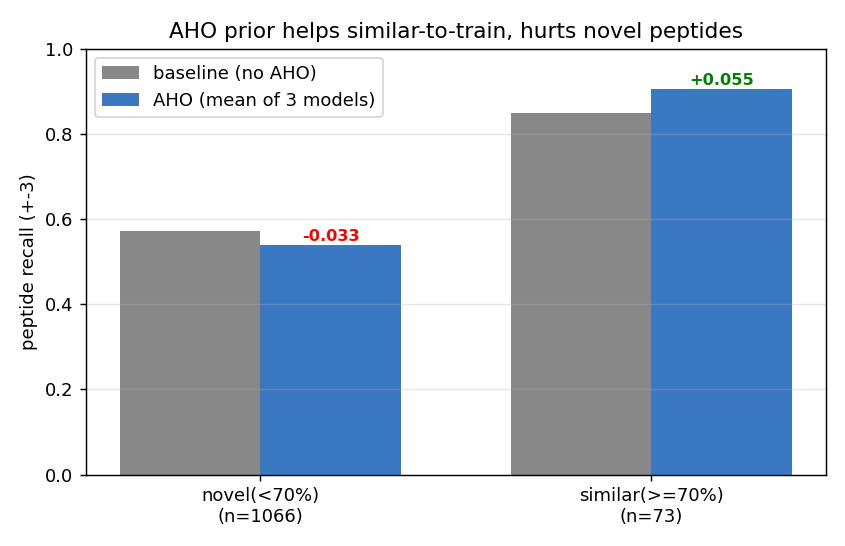
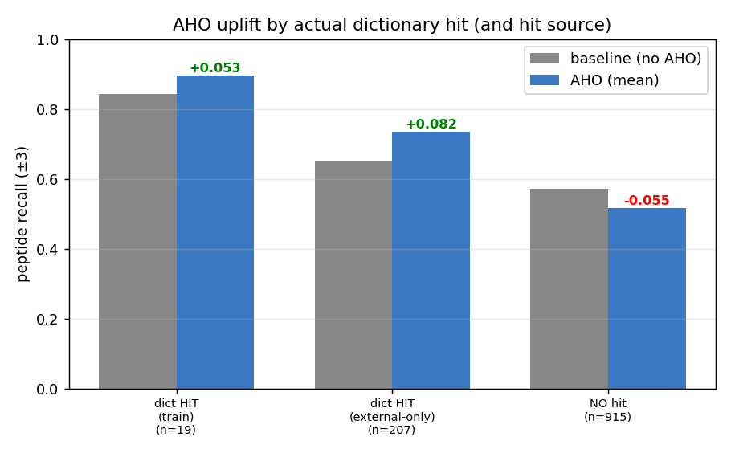

# Does the AHO prior help — and on which peptides?

**What AHO is.** An Aho–Corasick dictionary of known bioactive peptides; the model
receives a per-residue feature marking substrings already known to be active.
Supervisor's concern: part of any gain may be **retrieval of known peptides**
rather than genuine generalization.

**Dictionary actually used** (from `data/embeddings_aho_train012/config.json` +
`summary.json`, the embedding these AHO models trained on) — **49,286 peptides**:
- `dbamp_3` 25,271 · `dramp_general` 8,801 · `dramp_natural` 4,211 ·
  `apd6_natural` 2,872 — four external AMP databases, included **in full**;
- `uniprot_2022` 8,131 — **train folds (0,1,2) only** (of 13,510), so held-out test
  peptides are NOT in the dictionary (no exact-match leakage).

So this is the strong/"sad" version of the question: the dictionary is not merely
"train peptides" — it contains ~41k external bioactive peptides from the major AMP
databases. The result below therefore says AHO fails on novel peptides **despite** a
49k-entry external dictionary, not because the dictionary was too small.

**Method.** Run TEST inference for a no-AHO baseline (`train_run_esm2`) and three
AHO-fusion models (`esm2_aho_emission_fusion`, `_h32`, `esm2_aho_mid_fusion_raw_m64`).
For each true test **peptide** record whether it was recovered (±3 matching) and
join its sequence to its max-identity-to-train bucket from the peptide-similarity
analysis: **similar = ≥70% identity to a train peptide, novel = <70%**.
Reproduce: `analysis/aho_similarity_analysis.py` → `analysis/aho_analysis/`.

## Result: AHO is a retrieval mechanism

Recall (±3) on true test peptides, by bucket:

| model | recall novel (<70%, n=1066) | recall similar (≥70%, n=73) | recall all |
|---|---:|---:|---:|
| baseline (no AHO) | 0.571 | 0.849 | 0.590 |
| esm2_aho_emission_fusion | 0.537 | 0.890 | 0.560 |
| esm2_aho_emission_fusion_h32 | 0.545 | 0.932 | 0.570 |
| esm2_aho_mid_fusion_raw_m64 | 0.532 | 0.890 | 0.556 |
| **AHO uplift over baseline** | **−0.033** | **+0.055** | **−0.026** |

Two things stand out:

1. **Similarity drives recall even without AHO.** The baseline already recovers
   similar-to-train peptides far better than novel ones (0.85 vs 0.57). This is the
   same coverage effect seen in the peptide-similarity report.

2. **The AHO prior only helps on the similar bucket, and slightly hurts on novel
   peptides** (+0.055 vs −0.033). I.e. AHO improves recovery of peptides resembling
   ones it has memorized, but adds noise on genuinely novel peptides — exactly the
   "retrieval, not generalization" failure the supervisor anticipated.

## Why AHO doesn't win overall

Only ~6% of test peptides are ≥70% similar to train (peptide-similarity report), so
the novel bucket (n=1066) dwarfs the similar one (n=73). AHO's retrieval gain on the
small similar bucket cannot offset its small loss on the large novel bucket, so
**overall recall with AHO is no better than (slightly below) baseline** — which is
why the AHO rows never beat the ESM2 baseline in the architecture table. The prior
helps precisely where it is least needed (peptides already easy because they resemble
training data) and not where the model actually struggles (novel peptides).

## Refinement: stratify by whether the dictionary actually FIRES

Bucketing by similarity-to-train is a proxy — the dictionary also holds ~41k
external AMP-DB peptides, so a peptide novel to train can still be a dictionary hit.
The precise version reads the precomputed AHO feature `pep.inside` and buckets each
true test peptide by whether the dictionary actually overlaps it (and by hit source:
train uniprot vs external-DB-only). Reproduce: `analysis/aho_dictionary_hit.py` →
`dictionary_hit_summary.md`.

| bucket | n | baseline recall | AHO recall | uplift |
|---|---:|---:|---:|---:|
| dictionary HIT | 226 | 0.668 | 0.748 | **+0.080** |
| ↳ train hit | 19 | 0.842 | 0.895 | +0.053 |
| ↳ external-only hit | 207 | 0.652 | 0.734 | **+0.082** |
| NO hit | 915 | 0.570 | 0.516 | **−0.055** |

This sharpens — and partly **revises** — the picture:

1. **The dictionary covers ~20% of test peptides** (226/1141), and that coverage is
   overwhelmingly from the **external** databases (207 external-only vs 19 train) —
   the AMP DBs genuinely reach peptides that train does not.
2. **Where the dictionary fires, AHO genuinely helps (+0.08 recall), and it helps
   external-DB-only hits just as much as train hits** (+0.082 vs +0.053). So AHO is
   *not* merely retrieving memorized train peptides — it successfully exploits the
   external AMP knowledge base on peptides that are novel to the training set. That
   is a real, useful signal.
3. **But the dictionary is silent on the other ~80%, and there the AHO channel is
   net noise (−0.055)** — the AHO-trained models do slightly worse than the pure
   baseline on peptides with no hit.
4. **Net:** the gain on the covered 20% cannot outweigh the penalty on the
   uncovered 80%, so overall AHO ≤ baseline. The bottleneck is **dictionary
   coverage**, not the idea itself.

**Actionable implication.** A *gated* AHO (apply the prior only where `pep.inside>0`,
leave no-hit residues untouched) would keep the +0.08 on hits and remove the −0.055
penalty on misses — a concrete follow-up experiment. Broader/again-larger AMP
dictionaries would raise the 20% coverage.

## Caveats

- `train hit` n=19 is tiny (noisy); the solid signal is external-only (n=207) and
  no-hit (n=915), consistent across all three AHO models.
- Peptides only (the AHO dictionaries are dominated by mature peptides, not
  propeptides), matching how the prior was designed.
