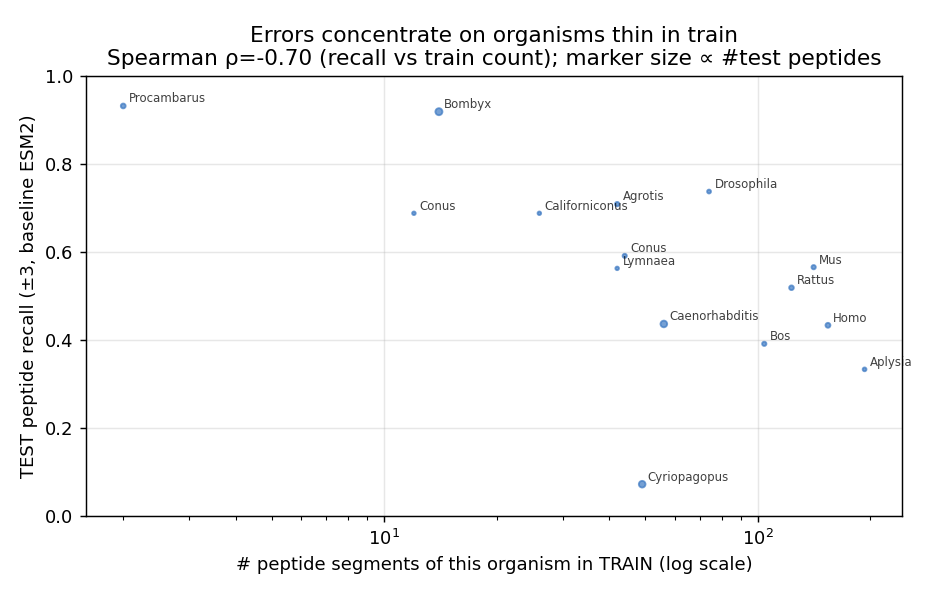
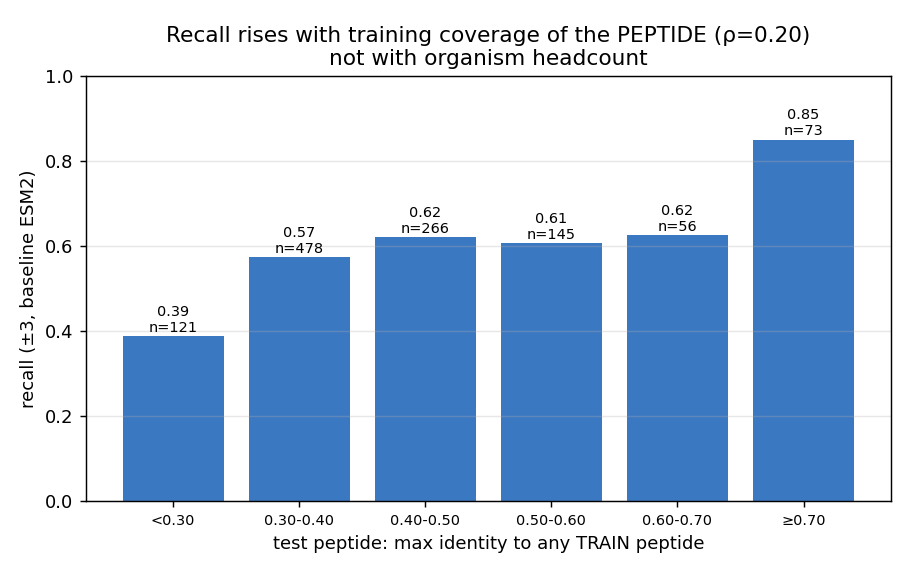

# Откуда берутся ошибки — и что на самом деле значит «больше данных»

Естественная гипотеза к аргументу про потолок по данным: *модель ошибается на
организмах, недопредставленных в обучении*. Мы проверили её напрямую — и она **неверна**,
причём поучительно. Правильная ось — это покрытие **пространства последовательностей
пептидов**, а не число белков по организму.

## 1. Число белков по организму НЕ предсказывает ошибку (даже слегка анти-коррелирует)

Для каждого организма: число пептидных сегментов в TRAIN против peptide recall базовой
модели на TEST (`analysis/errors/src/error_vs_train_abundance.py`).

Спирмен ρ(число в train, recall) = **−0.70**. Примеры:

| организм | пептидов в train | recall на test |
|---|---:|---:|
| Procambarus clarkii | 1 | 0.93 |
| Bombyx mori | 13 | 0.92 |
| Cyriopagopus hainanus | 48 | 0.07 |
| Homo sapiens | 153 | 0.43 |
| Aplysia californica | 192 | 0.33 |

Организм с **единственным** обучающим пептидом (Procambarus) распознаётся с recall 0.93,
тогда как *Homo sapiens* (153 пептида в train) — лишь на 0.43. То есть «мало примеров
этого организма» — **не** причина провала.

**Почему:** модель учит пептидные *семейства*, а не организмы. Консервативные
семейства токсинов / нейропептидов повторяются у разных видов, поэтому едва
представленный организм распознаётся, если его пептиды принадлежат хорошо покрытому
семейству. И наоборот, хорошо изученные млекопитающие дают много *разнообразных*
пептидов, а GraphPart-сплит (held-out белки <30% идентичности) делает их TEST-пептиды
по-настоящему новыми — самыми трудными.

## 2. Покрытие на уровне пептидов в обучении ДЕЙСТВИТЕЛЬНО предсказывает ошибку

Разбиваем каждый TEST-пептид по максимальной идентичности к любому TRAIN-пептиду
(`analysis/aho/aho_analysis/aho_segments.csv`, базовая ESM2):

| макс. идентичность к train-пептиду | n | recall |
|---|---:|---:|
| < 0.30 (нет похожего train-пептида) | 121 | **0.39** |
| 0.30–0.40 | 478 | 0.57 |
| 0.40–0.50 | 266 | 0.62 |
| 0.50–0.60 | 145 | 0.61 |
| 0.60–0.70 | 56 | 0.63 |
| ≥ 0.70 (близкий train-аналог) | 73 | **0.85** |

Recall монотонно растёт с тем, насколько хорошо *пептид* покрыт в обучении: пептиды без
похожего обучающего примера распознаются на 0.39; те, у кого есть ≥70%-идентичный
обучающий пептид — на 0.85.

## 3. Исправленный аргумент «больше данных»

Собирая три куска вместе:

- **Кривая масштабирования всё ещё растёт при 100%** (`data_scaling.md`): больше
  обучающих данных продолжает улучшать модель — потолок не достигнут.
- **Recall управляется покрытием пептидных семейств** (§2), а не числом белков по
  организму (§1).
- Held-out пептиды **в основном новые** (лишь ~6% имеют ≥70% сходства с train;
  `peptide_similarity.md`).

Значит рычаг — это **больше данных, расширяющих покрытие пространства
последовательностей пептидов** — новые пептидные семейства, а не больше белков из уже
виденных семейств. Добавить 1000 человеческих белков, чьи пептиды похожи на уже
имеющиеся в обучении, поможет мало; набирать недопокрытые пептидные семейства (хвост
<0.30 сходства, где recall = 0.39) — вот что сдвинет дело. Это более точная и
действенная версия тезиса «нужно больше данных», чем подсказал бы сырой подсчёт по
организмам.
