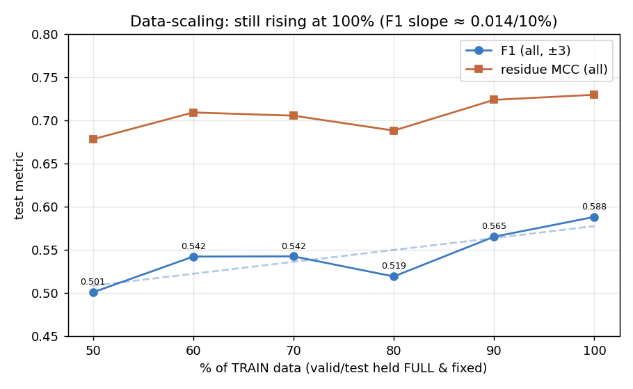

# Data-scaling: is the model data-limited?

**Question.** Train the ESM2 baseline on increasing fractions of the training data
and see whether test performance has plateaued (architecture-limited) or is still
rising (data-limited).

**Method (corrected).** The pre-existing scaling runs were unreliable —
`select_subdata_ids.py` subsampled **every** GraphPart cluster, so smaller runs were
evaluated on *smaller, different* test sets (not comparable), and `train_run_esm2_25`
even pointed at the 50% file. This series fixes that: subsample **TRAIN clusters
(0,1,2) only**, keep **valid(3)+test(4) FULL and identical** across all fractions,
seeded (`--seed 42`). Same baseline config (`lstmcnncrf`, 100 epochs, bs 48, lr 1e-4).
Metrics from a single deterministic inference pass over all six points (so they are
directly comparable; MCC/AUC are residue-level and unaffected by the ±3 metric bug).
Reproduce: `analysis/make_scaling_subsets.py` → `analysis/run_data_scaling.sh` →
`runs/scaling_trainfrac{50..90}` (+ existing `train_run_esm2_100` for 100%).

| % train | F1 all (±3) | residue MCC all | residue AUC all |
|---:|---:|---:|---:|
| 50 | 0.501 | 0.678 | 0.813 |
| 60 | 0.542 | 0.709 | 0.796 |
| 70 | 0.542 | 0.705 | 0.800 |
| 80 | 0.519 | 0.688 | 0.799 |
| 90 | 0.565 | 0.724 | 0.812 |
| 100 | 0.588 | 0.729 | 0.764 |

## Findings

- **Performance is still rising at 100% of the data — no plateau.** F1 climbs from
  0.50 (half the train set) to 0.59 (full), MCC from 0.68 to 0.73. The slope is
  ≈ **+0.014 F1 per +10% train**, and the last step 90→100% is still
  **+0.023 F1 / +0.006 MCC**. The model is **data-limited**, not
  architecture-limited: more training data would still improve it.
- **Single-run variance is ~±0.02 F1.** The dip at 80% persists under deterministic
  inference, so it is real training noise (one seed per point), not a metric
  artifact — read the curve as a trend, not point-by-point. (A cleaner curve would
  average 3 seeds per fraction; deferred as it triples the ~20 h compute.)

## Interpretation (the ceiling argument)

This is the quantitative version of "we are not at the data ceiling": within the
*current* dataset the curve has not flattened, so the limiting factor is **dataset
size / coverage**, consistent with the error analysis (recall collapses on
under-represented organisms) and the peptide-similarity analysis (held-out peptides
are mostly novel). Architecture and embedding changes moved metrics by ≲0.02 (the
experiment tables) — the same magnitude as a 10% change in train data here — which is
why no architectural variant decisively beat the baseline. The actionable lever is
**more / broader training data**, not a bigger model.

The complementary direction (does a *lighter* model keep the same performance?) is a
natural follow-up but was not run here.
