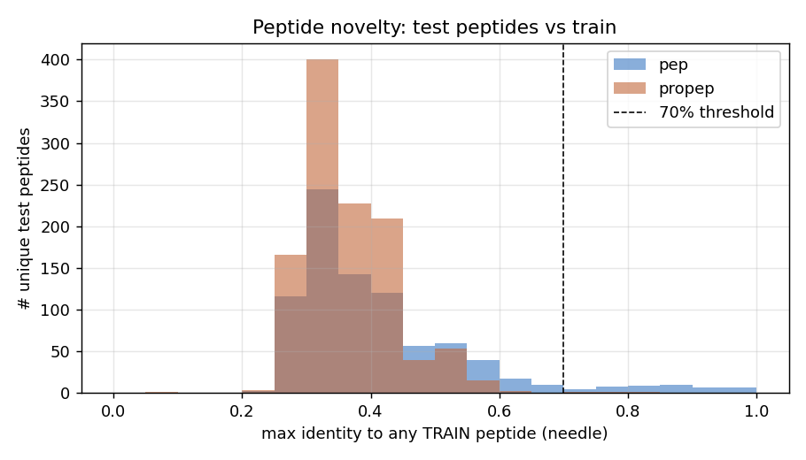
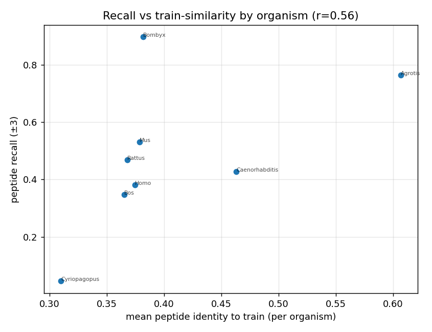

# Похожесть пептидов к train и её связь с recall

**Вопрос.** Сплит train/val/test разделён по гомологии на уровне **целых белков**
(GraphPart `needle --threshold 0.3`). Делает ли это новыми и сами *сегменты* пептидов,
или консервативные пептидные мотивы протекают через сплит? И объясняет ли новизна
пептидов то, где модель ошибается?

**Метод.** Извлекаем сегменты пептидов/пропептидов (слитые координаты) по каждому
сплиту, дедуплицируем до уникальных последовательностей и выравниваем каждый уникальный
held-out (valid/test) пептид против всех train-пептидов **того же типа** с помощью EMBOSS
`needleall` (глобальный Нидлман–Вунш — то семейство выравнивателей, что использует
GraphPart). Для каждого held-out пептида берём его **максимальную идентичность к любому
train-пептиду** (идентичность = совпадения / длина выравнивания, согласовано с
GraphPart). Также фиксируем coverage = совпадения / min(длин), чтобы выявить вложение
короткого в длинный, которое идентичность по длине выравнивания недооценивает. Полное
определение метода — в `methodology.md` §4. Воспроизведение:
`analysis/similarity/src/peptide_similarity.py` →
`analysis/similarity/peptide_similarity.csv`.

## 1. Held-out пептиды по-настоящему новые

| сплит / тип | n уник. | медиана макс.-идентичности | ≥70% идентичности | ≥70% coverage |
|---|---:|---:|---:|---:|
| test / pep | 852 | 0.37 | **6%** | 8% |
| test / propep | 1118 | 0.35 | **0%** | 2% |
| valid / pep | 747 | 0.34 | 5% | 9% |
| valid / propep | 1068 | 0.36 | 1% | 4% |

Лишь ~6% тестовых пептидов (и по сути 0% пропептидов) имеют ≥70%-идентичного двойника в
train; медианный пептид сидит на ~0.35 идентичности — близко к базовому уровню
глобального выравнивания неродственных коротких последовательностей. То есть
белковый сплит на 30% **переносится** и на уровень пептидов: held-out оценка измеряет
обобщение на **невиданные** пептиды, а не запоминание мотивов. (Оговорка: использование
*coverage* вместо идентичности по длине выравнивания поднимает долю «похожих» лишь до
8–9% — горстка тестовых пептидов это короткие фрагменты внутри более длинного
train-пептида; картину это не меняет.)

## 2. Новизна отслеживает recall — потолок задаёт покрытие, а не архитектура

По организмам (тестовые пептиды, организмы с ≥20 сегментами), средняя похожесть пептидов
к train против peptide recall модели:

| организм | средняя идентичность к train | peptide recall | n |
|---|---:|---:|---:|
| Cyriopagopus hainanus | 0.31 | **0.05** | 495 |
| Bos taurus | 0.37 | 0.35 | 204 |
| Rattus norvegicus | 0.37 | 0.47 | 243 |
| Homo sapiens | 0.37 | 0.38 | 270 |
| Mus musculus | 0.38 | 0.53 | 207 |
| Bombyx mori | 0.38 | 0.90 | 549 |
| Caenorhabditis elegans | 0.46 | 0.43 | 495 |
| Agrotis ipsilon | 0.61 | 0.76 | 216 |

Корреляция r = **0.56**. Худший организм — *Cyriopagopus hainanus* (яд паука), recall
0.05 — он же **наименее похож на train** (0.31, т.е. осмысленно похожего train-пептида
не существует), а самый похожий организм (*Agrotis*, 0.61) распознаётся хорошо (0.76).
Это чистая форма аргумента про потолок по данным: модель ошибается именно там, где
обучающие данные не покрывают пространство пептидов.

Корреляция умеренная, не идеальная, потому что **обилие в train** — вторая ось:
*Bombyx mori* имеет лишь среднюю похожесть (0.38), но recall 0.90 — он тяжело
представлен в train по количеству (549 тестовых сегментов и соответственно много в
train), так что модель учит его пептидную грамматику несмотря на низкую попарную
идентичность. То есть recall управляется *покрытием пространства пептидов* (и похожестью,
и обилием в train), а не архитектурой — согласуется с почти-плоскими различиями по
таблицам архитектур/эмбеддингов.

## 3. Артефакт для дальнейшего использования

`analysis/similarity/peptide_similarity.csv` (одна строка на уникальный held-out пептид:
seq, type, split, length, n_occurrences, organisms, `max_identity_to_train`,
`coverage_at_best`, `best_train_seq`, `is_similar_70`) — ключ джойна для **AHO-анализа**
(«насколько AHO-приор помогает на пептидах, похожих на train (≥70%), против новых») и
для любой стратификации ошибок по похожести на уровне пептидов.
