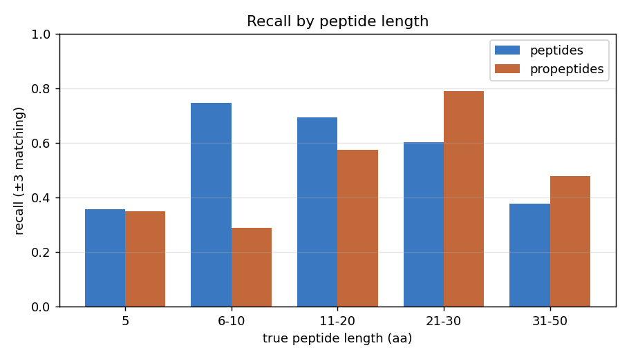
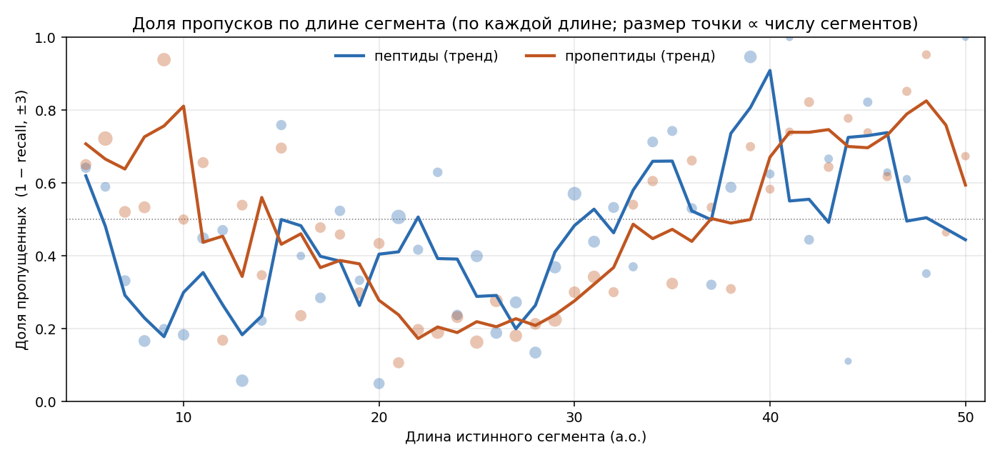
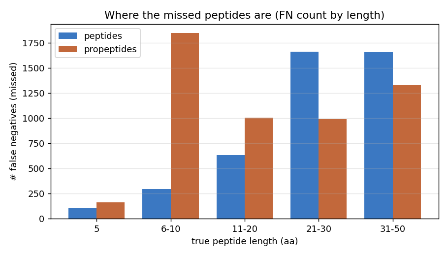
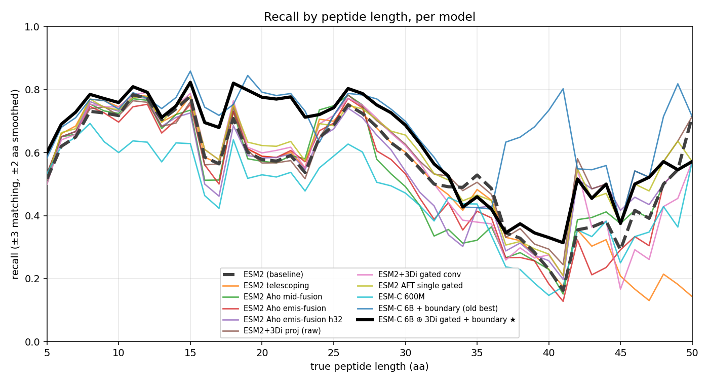
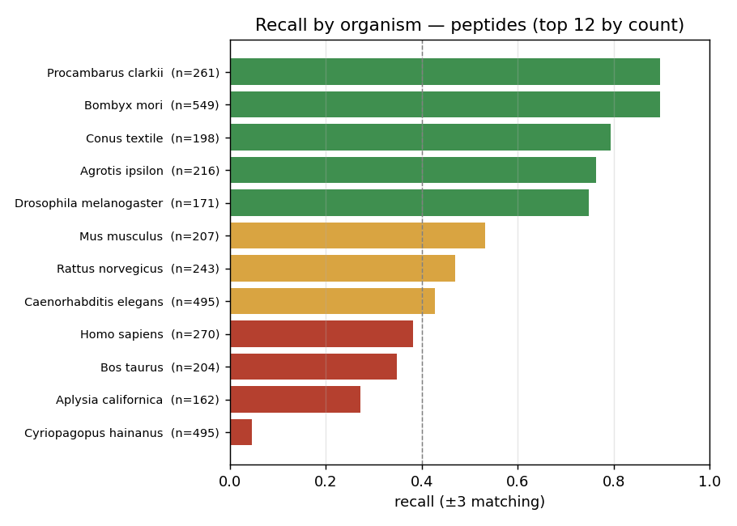
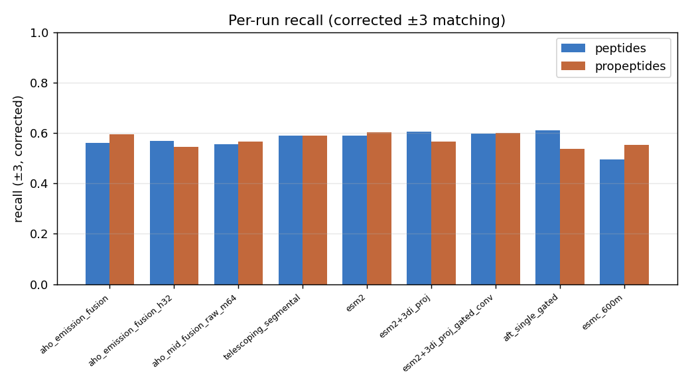

# Разбор ошибок: где предсказатель пептидов проваливается

**Объём.** Инференс на held-out TEST-партиции (GraphPart кластер 4) для топ-5 моделей
каждой таблицы результатов (архитектурные изменения ∪ генераторы эмбеддингов), всего 9
запусков, 29 514 истинных/предсказанных сегментов. Поостаточные исходы агрегированы по
**длине пептида** и по **организму**, чтобы локализовать систематические режимы провала.

**Правило матчинга.** Истинный пептид (или пропептид) считается *найденным*, если у
какого-то предсказания И начало, И конец попадают в **±3 остатка** от члена группы —
окно допуска, принятое во всём DeepPeptide. Перекрывающиеся истинные аннотации
схлопываются в одну группу (достаточно найти любого члена). Recall = найдено / всего
истинных групп; предсказание, не совпавшее ни с одной истинной группой, — ложноположительное.

> Все числа recall здесь используют **исправленную** реализацию матчера ±3. У штатной
> метрики (`manuscript_metrics.get_counts_for_protein`) есть баг, занижающий recall на
> ~2–4 п.п.; см. последний раздел и `methodology.md`. На *относительные* выводы это не
> влияет (баг — почти константный сдвиг по запускам и по бинам длины/организма).

Воспроизведение: `env/bin/python analysis/errors/src/error_analysis.py` →
`analysis/errors/error_stats/`; рисунки — `env/bin/python analysis/errors/src/plot_error_analysis.py`.

---

## 1. Длина — доминирующий фактор, и это не короткие пептиды



| длина (а.о.) | recall пептидов | recall пропептидов |
|---|---:|---:|
| 5 | 0.36 | 0.35 |
| 6–10 | **0.75** | 0.29 |
| 11–20 | 0.69 | 0.57 |
| 21–30 | 0.60 | **0.79** |
| 31–50 | 0.38 | 0.48 |

У пептидов и пропептидов **противоположные** профили по длине. Пептиды лучше всего
распознаются в диапазоне 6–20 а.о. и резко деградируют на **длинных** сегментах (31–50
а.о. → 0.38). Пропептиды хуже всего на **коротких** сегментах (6–10 а.о. → 0.29) и лучше
всего на 21–30 а.о. Истинные сегменты в этом датасете/кодировке меток обрезаны на 50
а.о. (у многосостоянийного CRF 50 состояний длины на класс), так что бина 51+ нет.

**Доля пропусков по длине** (1 − recall), по каждой целочисленной длине (размер точки ∝
числу сегментов, линии — взвешенный по поддержке скользящий тренд):



Тонкая детализация подтверждает и уточняет картину: у **пептидов** доля пропусков
минимальна около 7–9 и 25–28 а.о. и резко растёт на длинных (>35 а.о. — больше половины
теряется); у **пропептидов** — наоборот, хуже всего на коротких (5–13 а.о.) и на самых
длинных, лучше всего на 18–30 а.о. Профили двух классов почти зеркальны по длине.

Для сравнения, где сидит абсолютная **масса** ошибок (число пропущенных, не доля):



Для **пептидов** промахи концентрируются в бинах 21–30 и 31–50 (~1660 FN каждый) — то
есть модель теряет больше всего на длинных пептидах, и потому что там низкий recall, и
потому что эти бины хорошо населены.

### Профиль по длине у разных моделей



Все модели разделяют одну и ту же перевёрнутую U (пик на 6–20 а.о., спад на обоих
краях), так что ни одна архитектура заметно не меняет зависимость от длины. Единственное
устойчивое отличие: **3Di-структурная** модель (`esm2+3di_proj`) лучшая на самых трудных
длинах (длина 5 → 0.444, длина 31–50 → 0.449 против базовых 0.389 / 0.405) — структурный
контекст помогает именно там, где чисто-последовательностные модели буксуют (см.
`structural_potential.md`). 600M-запуск ESM-C равномерно самый низкий. (Пока не включает
победителя ESM-C 6B + boundary — для добавления нужен GPU-проход инференса; в очереди.)

### Крошечные пептиды (длина 5) — *не* проблема

Часто возникает вопрос, не исключить ли совсем короткие пептиды (≤5 а.о., сравнимые с
самим окном ±3). По соображениям ошибок — не стоит:

- **Пептиды:** 162 истинных сегмента длины 5, recall 0.36 — но лишь **104 из 4359 всех
  FN (2.4%)**.
- **Пропептиды:** 252 истинных сегмента длины 5, recall 0.35 — лишь **164 из 5339 FN (3.1%)**.

Исключение сегментов длины 5 убирает <3% ошибок и пару сотен примеров. Рычаг — на
длинных пептидах и на недопредставленных организмах (ниже), а не на крошечных.

---

## 2. Организм — вторая ось: провал ведёт недопредставленность в train



Peptide recall варьируется от **0.05 до 0.90** по самым частым организмам:

| организм | recall | группа |
|---|---:|---|
| Bombyx mori | 0.90 | хорошо (>0.7) |
| Procambarus clarkii | 0.90 | хорошо (>0.7) |
| Conus textile | 0.79 | хорошо (>0.7) |
| Agrotis ipsilon | 0.76 | хорошо (>0.7) |
| Drosophila melanogaster | 0.75 | хорошо (>0.7) |
| Homo sapiens | 0.38 | плохо (<0.4) |
| Bos taurus | 0.35 | плохо (<0.4) |
| Aplysia californica | 0.27 | плохо (<0.4) |
| Cyriopagopus hainanus | 0.05 | плохо (<0.4) |

Выдающийся провал — **Cyriopagopus hainanus** (яд паука, 495 тестовых пептидов, recall
0.05 — по сути никогда не распознаётся). Это отслеживает GraphPart-сплит: ядовитые
организмы вроде *Cyriopagopus* и *Lycosa* сконцентрированы в valid/test-партициях и едва
присутствуют в train (см. `analysis/dataset/dataset_stats_2022.md`), так что модель
никогда не учит их пептидную грамматику. **Recall у Homo sapiens лишь 0.38**, что важно,
потому что «homo-only» срез оценки и мал, и лежит на трудной стороне распределения.

Вывод: потолок здесь задаётся **покрытием в train разнообразия организмов/пептидных
семейств**, а не архитектурой модели — согласуется с почти-плоскими различиями метрик по
таблицам архитектур и эмбеддингов.

> Уточнение: «недопредставленность в train» точнее формулируется не как число белков по
> организму, а как покрытие пептидных *семейств* — см. `data_need.md` (число белков по
> организму даже анти-коррелирует с recall, ρ=−0.70; предсказывает recall именно
> покрытие на уровне пептидов).

---

## 3. Вид по запускам



Различия recall между топовыми архитектурами/эмбеддингами малы (peptide recall
~0.50–0.61) по сравнению с разбросом, который задают длина и организм. Ни одна топовая
модель не спасает трудные бины; структура провала общая.

---

## 4. Штатная метрика занижает recall (баг — унаследован от исходного DeepPeptide)

У `manuscript_metrics.get_counts_for_protein` (метрики поиска пептидов ±3, стоящей за
всеми P/R/F1) есть **баг затенения переменной**:

```python
for idx, row in true_df.iterrows():        # idx = индекс истинной строки
    ...
    for idx, row in pred_df.iterrows():    # переопределяет idx на индекс ПРЕДСКАЗАНИЯ
        if start_match and stop_match:
            true_df.loc[idx, 'matched'] = True   # пишет в строку с меткой ПРЕДСКАЗАНИЯ, не истины
            break
```

Когда истинный пептид совпадает, флаг `matched` пишется в `true_df.loc[<индекс
предсказания>]` вместо текущей истинной строки. Если у белка **больше предсказаний, чем
истинных сегментов**, индекс совпавшего предсказания выходит за диапазон истинных
индексов, так что `.loc` *создаёт фантомную строку* с `group = NaN`, которую
`groupby('group')` затем молча отбрасывает — совпадение теряется. Идеально предсказанный
пептид может из-за этого посчитаться как промах:

```
true=[(10,30)]  pred=[(200,220),(10,30)]   # 2-е предсказание — точное попадание
  штатная метрика (tp,fn,fp) = (0, 1, 1)    # засчитано как ПРОМАХ
  исправленная     (tp,fn,fp) = (1, 0, 1)
```

**Этот баг присутствует и в исходном коде DeepPeptide** (проверено), так что
приводимые здесь числа остаются прямо сопоставимыми с оригинальной статьёй — именно
поэтому мы *сохраняем* опубликованные значения и приводим исправленный столбец рядом, а
не переписываем. Эмпирически исправленный ±3 recall на почти-константные
**+0.024…+0.044 (пептиды) / +0.011…+0.023 (пропептиды)** выше опубликованного по всем
запускам, так что ранжирование моделей не меняется. Полная таблица оригинал-против-исправленного
— в `analysis/metrics/big_metrics_table.md` (и `corrected_metrics.csv`).

*Исправление (если когда-нибудь понадобится):* дать внутреннему циклу свою переменную
(`for p_idx, p_row in pred_df.iterrows(): ... true_df.loc[t_idx,'matched']=True;
pred_df.loc[p_idx,'matched']=True`). Его применение сдвинуло бы каждое приводимое число
вверх на ~2–4 п.п. и сломало бы сопоставимость со статьёй — поэтому оставлено как
задокументированная находка с двойным отчётом.
